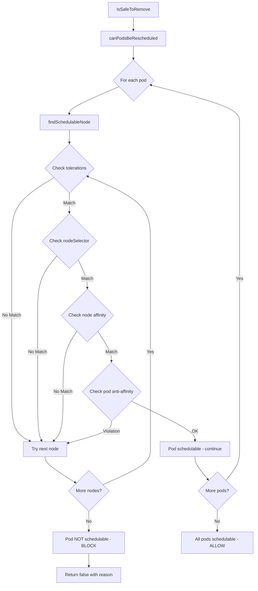
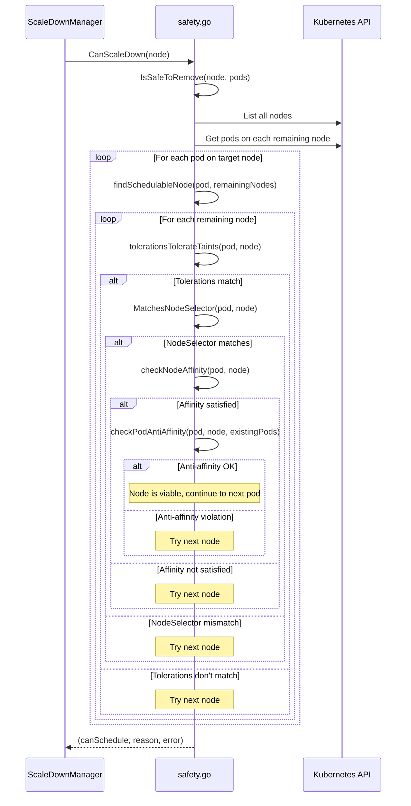

# Enhanced Scale-Down Safety with Pod Reschedulability Verification

**Status**: Proposed
**Author**: Design Specialist
**Created**: 2026-01-11
**Last Updated**: 2026-01-11

## Agreement Checklist

Agreements with the user confirmed before design:

- [x] **Scope**: Enhance `canPodsBeRescheduled()` in safety.go with per-pod scheduling simulation
- [x] **Scope**: Add same-nodegroup protection in rebalancer executor.go
- [x] **Non-Scope**: No changes to scale-up path
- [x] **Non-Scope**: No changes to VPSie API integration
- [x] **Constraint**: Must integrate with existing `IsSafeToRemove()` flow
- [x] **Constraint**: Performance target: complete within 5 seconds for typical clusters
- [x] **Constraint**: Backward compatible - existing clusters continue to work

## Overview

This design document describes enhancements to the VPSie Kubernetes Autoscaler's scale-down safety mechanism. The current implementation only checks aggregate resource capacity before scale-down, which can lead to workload disruption when pods with special scheduling constraints (tolerations, nodeSelector, affinity) cannot be rescheduled to remaining nodes.

### Problem Statement

The current `canPodsBeRescheduled()` function in `pkg/scaler/safety.go`:
1. Only checks aggregate CPU/memory capacity with 20% buffer
2. Does NOT check per-pod tolerations against node taints
3. Does NOT verify per-pod nodeSelector matches (helper exists but unused)
4. Does NOT simulate actual scheduling per pod

Additionally, the rebalancer's `TerminateNode()` function lacks protection against terminating nodes when the target nodegroup equals the current nodegroup, which could cause unnecessary churn.

### User Story

> "As a cluster operator, I want the autoscaler to only scale down nodes when all pods can be successfully rescheduled to remaining nodes, because this prevents workload disruption where pods with special scheduling constraints cannot find suitable target nodes."

## Existing Codebase Analysis

### Implementation Path Mapping

| Component | Path | Status | Purpose |
|-----------|------|--------|---------|
| Safety checks | `pkg/scaler/safety.go` | Existing (modify) | Pod reschedulability verification |
| Scale-down manager | `pkg/scaler/scaler.go` | Existing (minor) | Calls IsSafeToRemove, may need logging enhancement |
| Rebalancer executor | `pkg/rebalancer/executor.go` | Existing (modify) | Add same-nodegroup protection |
| Rebalancer types | `pkg/rebalancer/types.go` | Existing (reference) | CandidateNode, RebalancePlan types |

### Existing Interface Investigation

**safety.go Key Public Functions:**
- `IsSafeToRemove(ctx, node, pods)` - Main safety check orchestrator (502 references in tests)
- `canPodsBeRescheduled(ctx, pods)` - Current aggregate capacity check (called from IsSafeToRemove)
- `MatchesNodeSelector(node, pod)` - Exists but UNUSED
- `HasNodeSelector(pod)` - Exists but UNUSED
- `HasNodeAffinity(pod)` - Exists but UNUSED

**executor.go Key Public Functions:**
- `ExecuteRebalance(ctx, plan)` - Main entry point
- `TerminateNode(ctx, node)` - Called from rolling/surge batch execution
- `DrainNode(ctx, node)` - Pod eviction before termination

### Similar Functionality Search

| Search Term | Found | Location | Decision |
|-------------|-------|----------|----------|
| Toleration matching | None | - | New implementation required |
| NodeSelector validation | Exists unused | `safety.go:MatchesNodeSelector()` | Use existing helper |
| NodeAffinity check | Exists unused | `safety.go:HasNodeAffinity()` | Use existing helper |
| Same-nodegroup check | None | - | New implementation required |

### Current canPodsBeRescheduled Implementation Gap Analysis

```go
// Current implementation (lines 213-275 in safety.go)
func (s *ScaleDownManager) canPodsBeRescheduled(ctx context.Context, pods []*corev1.Pod) (bool, string, error) {
    // Only checks aggregate capacity - INSUFFICIENT
    // Does NOT iterate per-pod
    // Does NOT check tolerations
    // Does NOT use existing MatchesNodeSelector helper
}
```

## Prerequisite ADRs

- **ADR-0001-critical-security-fixes.md**: Establishes security patterns (relevant for safe node operations)

No common ADRs currently exist for scheduling constraint handling. This design establishes the pattern.

## Design Goals

1. **Per-Pod Scheduling Verification**: Verify each pod can be scheduled on at least one remaining node
2. **Toleration/Taint Matching**: Implement Kubernetes-compliant toleration matching algorithm
3. **NodeSelector Verification**: Utilize existing but unused `MatchesNodeSelector()` helper
4. **NodeAffinity Support**: Check pod affinity/anti-affinity constraints
5. **Same-NodeGroup Protection**: Prevent rebalancer from terminating when no actual migration occurs
6. **Performance**: Complete verification within 5 seconds for clusters with 100 nodes / 1000 pods
7. **Backward Compatibility**: Existing clusters continue to work without configuration changes

## Architecture Overview



## Data Flow



## Integration Point Map

```yaml
Integration Point 1:
  Existing Component: ScaleDownManager.IsSafeToRemove() (safety.go:17-112)
  Integration Method: Enhanced check within existing canPodsBeRescheduled call
  Impact Level: Medium (Data Usage - internal data processing change)
  Required Test Coverage: All existing IsSafeToRemove tests must pass

Integration Point 2:
  Existing Component: ScaleDownManager.CanScaleDown() (scaler.go:264-340)
  Integration Method: No changes needed - calls IsSafeToRemove which we enhance
  Impact Level: Low (Read-Only - observes enhanced behavior)
  Required Test Coverage: Verify enhanced reasons propagate correctly

Integration Point 3:
  Existing Component: Executor.TerminateNode() (executor.go:432-454)
  Integration Method: Add early return guard for same-nodegroup check
  Impact Level: Low (Early return, no existing behavior change)
  Required Test Coverage: New test for same-nodegroup protection

Integration Point 4:
  Existing Component: executeRollingBatch() (executor.go:148-238)
  Integration Method: Indirect - uses enhanced TerminateNode
  Impact Level: Low (Inherits new protection)
  Required Test Coverage: Integration test for rebalance with same nodegroup
```

## Change Impact Map

```yaml
Change Target: ScaleDownManager.canPodsBeRescheduled()
Direct Impact:
  - pkg/scaler/safety.go (method rewrite)
  - pkg/scaler/safety_test.go (new test cases)
Indirect Impact:
  - Scale-down blocking reasons become more specific
  - Metrics labels for "rescheduling" failures now include constraint type
No Ripple Effect:
  - scale-up path unchanged
  - VPSie API integration unchanged
  - NodeGroup reconciler unchanged
  - DrainNode behavior unchanged

Change Target: Executor.TerminateNode()
Direct Impact:
  - pkg/rebalancer/executor.go (add guard clause)
  - pkg/rebalancer/executor_test.go (new test case)
Indirect Impact:
  - Rebalance operations skip no-op terminations
No Ripple Effect:
  - DrainNode unchanged
  - provisionNewNode unchanged
  - Rollback logic unchanged
```

## Detailed Design

### 1. Enhanced canPodsBeRescheduled Algorithm

**Location**: `pkg/scaler/safety.go`

The enhanced function will:
1. Get all remaining schedulable nodes (excluding the node being removed)
2. For each pod on the target node:
   a. Find at least ONE node where the pod can be scheduled
   b. Fail-fast on first non-schedulable pod (performance optimization)
3. Check scheduling constraints in order of computational cost:
   - Tolerations vs Taints (cheapest)
   - NodeSelector (cheap)
   - NodeAffinity (moderate)
   - PodAntiAffinity (most expensive)

```go
// Pseudocode for enhanced canPodsBeRescheduled
func (s *ScaleDownManager) canPodsBeRescheduled(ctx context.Context, pods []*corev1.Pod) (bool, string, error) {
    // Get all nodes except the one being removed
    allNodes, err := s.client.CoreV1().Nodes().List(ctx, metav1.ListOptions{})
    if err != nil {
        return false, "", fmt.Errorf("failed to list nodes: %w", err)
    }

    // Filter to ready, schedulable nodes
    remainingNodes := filterReadySchedulableNodes(allNodes)
    if len(remainingNodes) == 0 {
        return false, "no available nodes for rescheduling", nil
    }

    // Build node info cache (pods per node) for anti-affinity checks
    nodePodsCache := buildNodePodsCache(ctx, remainingNodes)

    // Check each pod can be scheduled somewhere
    for _, pod := range pods {
        // Skip DaemonSet pods - recreated automatically
        if isSkippableDaemonSetPod(pod) {
            continue
        }

        schedulable, node := findSchedulableNode(pod, remainingNodes, nodePodsCache)
        if !schedulable {
            return false, fmt.Sprintf("pod %s/%s cannot be rescheduled: no suitable node found",
                pod.Namespace, pod.Name), nil
        }

        // Optimistically add pod to target node's cache for subsequent anti-affinity checks
        nodePodsCache[node.Name] = append(nodePodsCache[node.Name], pod)
    }

    return true, "", nil
}

func findSchedulableNode(pod *corev1.Pod, nodes []*corev1.Node, nodePodsCache map[string][]*corev1.Pod) (bool, *corev1.Node) {
    for _, node := range nodes {
        // Check 1: Tolerations match node taints (NoSchedule, NoExecute only)
        if !tolerationsTolerateTaints(pod.Spec.Tolerations, node.Spec.Taints) {
            continue
        }

        // Check 2: NodeSelector matches (uses existing helper)
        if !MatchesNodeSelector(node, pod) {
            continue
        }

        // Check 3: NodeAffinity requirements
        if !matchesNodeAffinity(pod, node) {
            continue
        }

        // Check 4: PodAntiAffinity constraints
        if hasPodAntiAffinityViolation(pod, node, nodePodsCache[node.Name]) {
            continue
        }

        // Found a suitable node
        return true, node
    }
    return false, nil
}
```

### 2. Toleration Matching Algorithm

**Per Kubernetes Official Documentation** ([Taints and Tolerations](https://kubernetes.io/docs/concepts/scheduling-eviction/taint-and-toleration/)):

```go
// tolerationsTolerateTaints checks if tolerations cover all taints with NoSchedule/NoExecute effect
func tolerationsTolerateTaints(tolerations []corev1.Toleration, taints []corev1.Taint) bool {
    for _, taint := range taints {
        // Only check hard constraints (NoSchedule, NoExecute)
        // PreferNoSchedule is soft - ignored for hard scheduling decisions
        if taint.Effect != corev1.TaintEffectNoSchedule &&
           taint.Effect != corev1.TaintEffectNoExecute {
            continue
        }

        // Check if any toleration matches this taint
        if !tolerationMatchesTaint(tolerations, &taint) {
            return false
        }
    }
    return true
}

func tolerationMatchesTaint(tolerations []corev1.Toleration, taint *corev1.Taint) bool {
    for _, toleration := range tolerations {
        if tolerationMatches(&toleration, taint) {
            return true
        }
    }
    return false
}

func tolerationMatches(toleration *corev1.Toleration, taint *corev1.Taint) bool {
    // Empty key with Exists operator matches all taints
    if toleration.Key == "" && toleration.Operator == corev1.TolerationOpExists {
        return true
    }

    // Key must match
    if toleration.Key != taint.Key {
        return false
    }

    // Effect must match (empty toleration effect matches all effects)
    if toleration.Effect != "" && toleration.Effect != taint.Effect {
        return false
    }

    // Operator-based value matching
    switch toleration.Operator {
    case corev1.TolerationOpExists:
        // Exists operator matches any value
        return true
    case corev1.TolerationOpEqual, "":
        // Equal operator (or default) requires value match
        return toleration.Value == taint.Value
    }

    return false
}
```

**Note**: Kubernetes v1.35 introduces Gt/Lt operators for numeric comparisons (alpha feature). This implementation focuses on stable operators (Equal, Exists) per current production best practices.

### 3. NodeAffinity Matching

```go
// matchesNodeAffinity checks if a pod's node affinity requirements are satisfied by a node
func matchesNodeAffinity(pod *corev1.Pod, node *corev1.Node) bool {
    if pod.Spec.Affinity == nil || pod.Spec.Affinity.NodeAffinity == nil {
        return true // No affinity requirements
    }

    nodeAffinity := pod.Spec.Affinity.NodeAffinity

    // Check required (hard) constraints
    if nodeAffinity.RequiredDuringSchedulingIgnoredDuringExecution != nil {
        if !matchesNodeSelectorTerms(node, nodeAffinity.RequiredDuringSchedulingIgnoredDuringExecution.NodeSelectorTerms) {
            return false
        }
    }

    // Preferred (soft) constraints are NOT checked for scale-down decisions
    // They express preferences, not requirements

    return true
}
```

### 4. PodAntiAffinity Check

```go
// hasPodAntiAffinityViolation checks if scheduling pod to node would violate anti-affinity rules
func hasPodAntiAffinityViolation(pod *corev1.Pod, node *corev1.Node, existingPods []*corev1.Pod) bool {
    if pod.Spec.Affinity == nil || pod.Spec.Affinity.PodAntiAffinity == nil {
        return false // No anti-affinity requirements
    }

    antiAffinity := pod.Spec.Affinity.PodAntiAffinity

    // Check required (hard) anti-affinity constraints only
    for _, term := range antiAffinity.RequiredDuringSchedulingIgnoredDuringExecution {
        for _, existingPod := range existingPods {
            if matchesPodAffinityTerm(existingPod, &term, node) {
                return true // Would violate anti-affinity
            }
        }
    }

    return false
}
```

### 5. Same-NodeGroup Protection in Rebalancer

**Location**: `pkg/rebalancer/executor.go`

The `TerminateNode()` function needs a guard to prevent terminating nodes when the rebalance plan's target nodegroup equals the source nodegroup.

**Problem**: The `CandidateNode` struct has `CurrentOffering` and `TargetOffering` (instance types), but not source/target NodeGroup names. The `RebalancePlan` has `NodeGroupName` which is the target.

**Solution**: Add a check in the execution path where we have access to both the plan's NodeGroupName and the node's current NodeGroup label.

```go
// In executeRollingBatch, before calling TerminateNode
func (e *Executor) executeRollingBatch(ctx context.Context, plan *RebalancePlan, batch *NodeBatch, state *ExecutionState) (*batchResult, error) {
    // ... existing code ...

    for _, candidate := range batch.Nodes {
        // NEW: Check if this is a same-nodegroup "rebalance" (no-op)
        currentNodeGroup := e.getNodeGroupFromNode(ctx, candidate.NodeName)
        if currentNodeGroup == plan.NodeGroupName && candidate.CurrentOffering == candidate.TargetOffering {
            logger.Info("Skipping termination: same nodegroup and offering",
                "nodeName", candidate.NodeName,
                "nodeGroup", plan.NodeGroupName,
                "offering", candidate.CurrentOffering)
            continue
        }

        // ... rest of existing code ...
    }
}

func (e *Executor) getNodeGroupFromNode(ctx context.Context, nodeName string) string {
    node, err := e.kubeClient.CoreV1().Nodes().Get(ctx, nodeName, metav1.GetOptions{})
    if err != nil {
        return ""
    }
    return node.Labels["autoscaler.vpsie.com/nodegroup"]
}
```

## Interface Change Matrix

| Existing Operation | New Operation | Conversion Required | Adapter Required | Compatibility Method |
|-------------------|---------------|---------------------|------------------|---------------------|
| `canPodsBeRescheduled(ctx, pods)` | `canPodsBeRescheduled(ctx, pods)` | None | Not Required | Same signature, enhanced logic |
| `MatchesNodeSelector(node, pod)` | `MatchesNodeSelector(node, pod)` | None | Not Required | Now used (was unused) |
| `HasNodeSelector(pod)` | `HasNodeSelector(pod)` | None | Not Required | Now used internally |
| `HasNodeAffinity(pod)` | `HasNodeAffinity(pod)` | None | Not Required | Now used internally |
| `TerminateNode(ctx, node)` | `TerminateNode(ctx, node)` | None | Not Required | Added guard clause |

## Integration Boundary Contracts

```yaml
canPodsBeRescheduled:
  Input: (context.Context, []*corev1.Pod) - Context and pods on node being removed
  Output: (bool, string, error) - Schedulable flag, reason message, error
  On Error: Return (false, "", error) - Propagate error to caller

tolerationsTolerateTaints:
  Input: ([]corev1.Toleration, []corev1.Taint) - Pod tolerations and node taints
  Output: bool - True if all hard-constraint taints are tolerated
  On Error: N/A (pure function, no errors)

findSchedulableNode:
  Input: (pod, nodes, nodePodsCache) - Pod, candidate nodes, cached pods per node
  Output: (bool, *corev1.Node) - Found flag and target node (nil if not found)
  On Error: N/A (pure function, no errors)

Executor.TerminateNode (enhanced):
  Input: (context.Context, *Node) - Context and node to terminate
  Output: error - Nil on success
  On Error: Return descriptive error with node name
  Guard: Skip silently if same-nodegroup with same offering
```

## Implementation Approach

**Selected Strategy**: Vertical Slice

**Rationale**:
- Feature is self-contained within the scale-down safety path
- Low inter-feature dependencies
- Can deliver value immediately after implementation
- Changes are localized to 3-4 files

**Verification Levels**:
- Task 1 (Toleration matching): L2 - Unit tests verify algorithm correctness
- Task 2 (Enhanced canPodsBeRescheduled): L2 - Unit tests verify integration
- Task 3 (Same-nodegroup protection): L2 - Unit tests verify guard clause
- Task 4 (Integration): L1 - E2E scenario validates full path

## Acceptance Criteria

### AC1: Toleration Matching
**Given** a pod with tolerations for specific taints (e.g., `gpu=true:NoSchedule`)
**When** the autoscaler evaluates scale-down of the pod's current node
**Then** scale-down is only permitted if at least one remaining node has matching taints

**Test Cases**:
- Pod tolerates `gpu=true:NoSchedule`, only remaining node has the taint - ALLOW
- Pod tolerates `gpu=true:NoSchedule`, no remaining nodes have the taint - BLOCK
- Pod tolerates `gpu=true:NoSchedule`, remaining node has `gpu=false:NoSchedule` - BLOCK
- Pod has no tolerations, remaining node has `NoSchedule` taint - BLOCK
- Pod has wildcard toleration (empty key + Exists), any taint - ALLOW

### AC2: NodeSelector Matching
**Given** a pod with nodeSelector constraints (e.g., `disktype: ssd`)
**When** the autoscaler evaluates scale-down
**Then** scale-down is only permitted if at least one remaining node has matching labels

**Test Cases**:
- Pod requires `disktype: ssd`, remaining node has label - ALLOW
- Pod requires `disktype: ssd`, no remaining nodes have label - BLOCK
- Pod has no nodeSelector - ALLOW (default)

### AC3: Anti-Affinity Verification
**Given** a pod with required pod anti-affinity rules
**When** the autoscaler evaluates scale-down
**Then** scale-down is only permitted if rescheduling would not violate anti-affinity rules

**Test Cases**:
- Pod has anti-affinity for pods with label `app=web` on same node, target node has no such pods - ALLOW
- Pod has anti-affinity for pods with label `app=web`, target node has pod with that label - BLOCK
- Preferred anti-affinity exists but would be violated - ALLOW (soft constraint)

### AC4: Clear Blocking Messages
**Given** a scale-down is blocked due to scheduling constraints
**When** the block decision is logged
**Then** the log message includes: pod name, constraint type, specific constraint that failed

**Log Format**:
```
"scale-down blocked"
  node=worker-1
  reason="pod myapp/web-abc123 cannot be rescheduled: no node tolerates taint gpu=true:NoSchedule"
```

### AC5: Same-NodeGroup Protection
**Given** a rebalance plan where source and target nodegroup are the same
**When** the executor processes the termination
**Then** the termination is skipped with an informational log message

**Test Cases**:
- Plan nodegroup = node's nodegroup, same offering - SKIP (log info)
- Plan nodegroup = node's nodegroup, different offering - PROCEED
- Plan nodegroup != node's nodegroup - PROCEED

### AC6: Backward Compatibility
**Given** an existing cluster with pods that have no special scheduling constraints
**When** upgrading to the new autoscaler version
**Then** scale-down behavior is unchanged (aggregate capacity still checked)

**Verification**:
- All existing safety.go unit tests pass without modification
- Scale-down of pods without tolerations/affinity works as before

## Non-Functional Requirements

| Requirement | Target | Verification Method |
|-------------|--------|---------------------|
| Performance | < 5 seconds for 100 nodes, 1000 pods | Benchmark test |
| Memory | < 50MB additional heap during check | Profiling |
| API Calls | Minimize K8s API calls using caching | Code review |
| Reliability | No panics on malformed pod specs | Fuzz testing |

## E2E Verification Procedures

### Phase 1: Unit Test Verification (L2)
```bash
go test ./pkg/scaler -run TestTolerationMatching -v
go test ./pkg/scaler -run TestEnhancedCanPodsBeRescheduled -v
go test ./pkg/rebalancer -run TestSameNodeGroupProtection -v
```

### Phase 2: Integration Test Verification (L2)
```bash
go test -tags=integration ./test/integration -run TestScaleDownWithTolerations -v
go test -tags=integration ./test/integration -run TestScaleDownWithNodeSelector -v
```

### Phase 3: E2E Scenario Verification (L1)
```bash
# Create cluster with tainted node
kubectl taint nodes worker-gpu gpu=true:NoSchedule

# Deploy pod with toleration
kubectl apply -f test/e2e/fixtures/pod-with-toleration.yaml

# Trigger scale-down evaluation
# Verify pod is NOT evicted if no other gpu-tainted node exists

# Add second gpu-tainted node
# Verify scale-down now proceeds
```

## Error Handling

| Error Condition | Handling | User Impact |
|-----------------|----------|-------------|
| Failed to list nodes | Return error, block scale-down | Safe - no action taken |
| Failed to get pods | Return error, block scale-down | Safe - no action taken |
| Malformed toleration | Log warning, treat as no toleration | Conservative - may block unnecessarily |
| Context cancelled | Return error immediately | Operation aborted cleanly |

## Monitoring and Observability

### New Metrics

```go
// Existing metric enhanced with new reason labels
metrics.SafetyCheckFailuresTotal.WithLabelValues(
    "rescheduling_toleration",  // NEW: specific constraint type
    nodeGroupName,
    nodeGroupNamespace,
).Inc()

metrics.SafetyCheckFailuresTotal.WithLabelValues(
    "rescheduling_nodeselector",  // NEW
    ...
).Inc()

metrics.SafetyCheckFailuresTotal.WithLabelValues(
    "rescheduling_antiaffinity",  // NEW
    ...
).Inc()
```

### Logging

Enhanced logging for debugging constraint failures:
```go
s.logger.Info("pod scheduling constraint check failed",
    "pod", pod.Name,
    "namespace", pod.Namespace,
    "constraintType", "toleration",
    "requiredTaint", "gpu=true:NoSchedule",
    "availableNodes", len(remainingNodes),
    "nodesChecked", nodesChecked)
```

## Security Considerations

- No new attack surface introduced
- All data comes from existing Kubernetes API
- No external network calls
- No credential handling

## Testing Strategy

### Unit Tests (pkg/scaler/safety_test.go)

| Test Name | Description | Priority |
|-----------|-------------|----------|
| TestTolerationMatches_ExactMatch | Exact key/value/effect match | High |
| TestTolerationMatches_ExistsOperator | Wildcard value matching | High |
| TestTolerationMatches_EmptyKeyExists | Universal toleration | Medium |
| TestTolerationMatches_EffectMismatch | Effect must match | High |
| TestTolerationsTolerateAllTaints | Multiple taints covered | High |
| TestNodeSelectorMatching | Existing helper integration | High |
| TestFindSchedulableNode_NoSuitableNode | All constraints fail | High |
| TestFindSchedulableNode_FirstViable | Finds first match | Medium |
| TestEnhancedCanPodsBeRescheduled_Integration | Full flow | High |

### Integration Tests (test/integration/)

| Test Name | Description |
|-----------|-------------|
| TestScaleDownBlockedByToleration | Real K8s API with tainted nodes |
| TestScaleDownAllowedWithMatchingToleration | Successful reschedule scenario |
| TestRebalancerSameNodeGroupSkip | Same-nodegroup protection |

## Rollback Plan

If issues are discovered after deployment:

1. **Feature Flag**: Not applicable (no new config options)
2. **Revert**: Git revert of the PR
3. **Impact**: Returns to aggregate-only capacity checking
4. **Data**: No persistent state changes

## Open Questions

1. **Q**: Should PreferNoSchedule taints be considered for extra safety?
   **A**: No, per Kubernetes semantics PreferNoSchedule is a soft constraint that doesn't prevent scheduling.

2. **Q**: Should we cache node taint/label information?
   **A**: Yes, build cache at start of canPodsBeRescheduled to avoid repeated API calls.

3. **Q**: How to handle pods with both tolerations AND affinity?
   **A**: Check all constraints in order; all must pass.

## Future Enhancements

1. **Topology Spread Constraints**: Add support for checking topologySpreadConstraints
2. **Resource Quota Awareness**: Consider namespace resource quotas in target node selection
3. **Priority-Based Ordering**: Consider pod priority when determining reschedule order
4. **Kubernetes v1.35 Gt/Lt Operators**: Add support when feature graduates to stable

## References

- [Kubernetes Taints and Tolerations](https://kubernetes.io/docs/concepts/scheduling-eviction/taint-and-toleration/) - Official documentation on toleration matching semantics
- [Kubernetes v1.35: Extended Toleration Operators](https://kubernetes.io/blog/2026/01/05/kubernetes-v1-35-numeric-toleration-operators/) - New numeric comparison operators (alpha)
- [Cluster Autoscaler FAQ](https://github.com/kubernetes/autoscaler/blob/master/cluster-autoscaler/FAQ.md) - Reference implementation for scheduling constraint handling
- [Kubernetes Autoscaling Best Practices 2025](https://www.sedai.io/blog/kubernetes-autoscaling) - Industry best practices for autoscaler design
- [GKE Cluster Autoscaler Documentation](https://cloud.google.com/kubernetes-engine/docs/concepts/cluster-autoscaler) - Reference for constraint-based scale-down blocking
