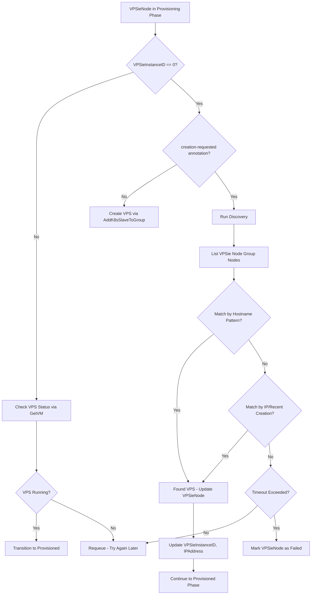
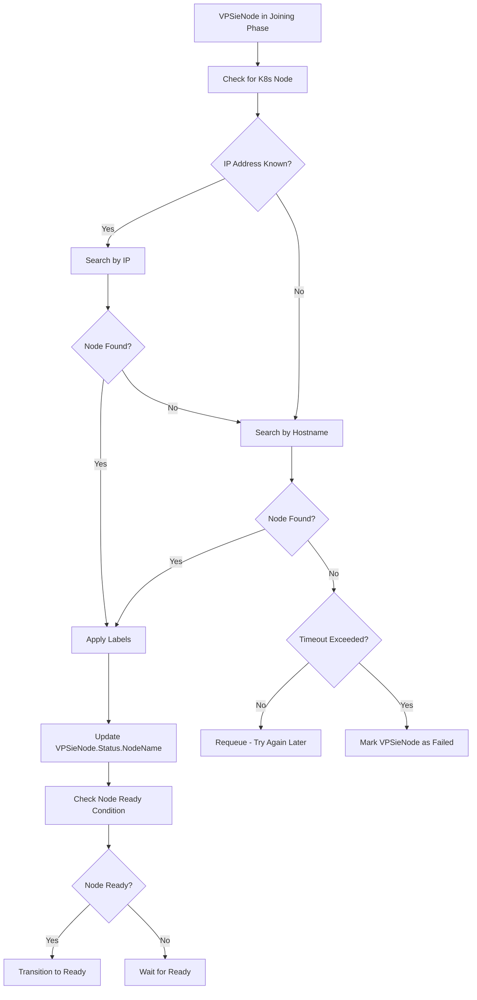
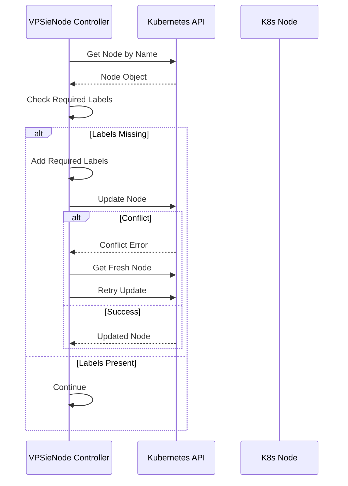
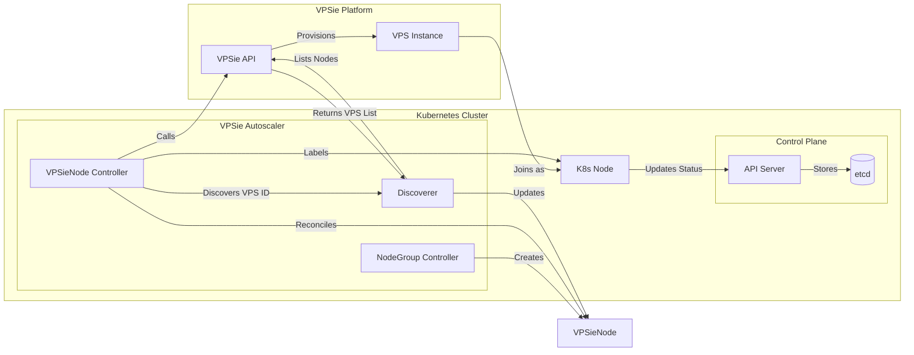
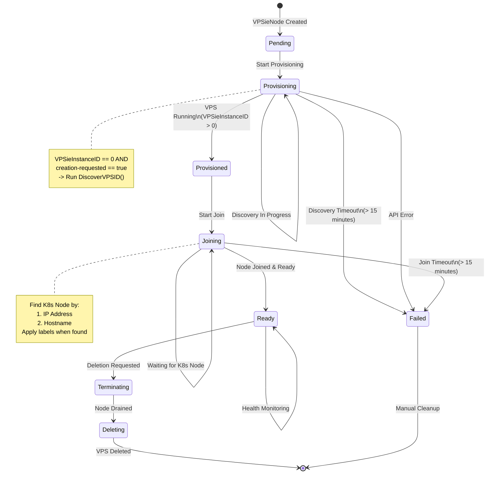
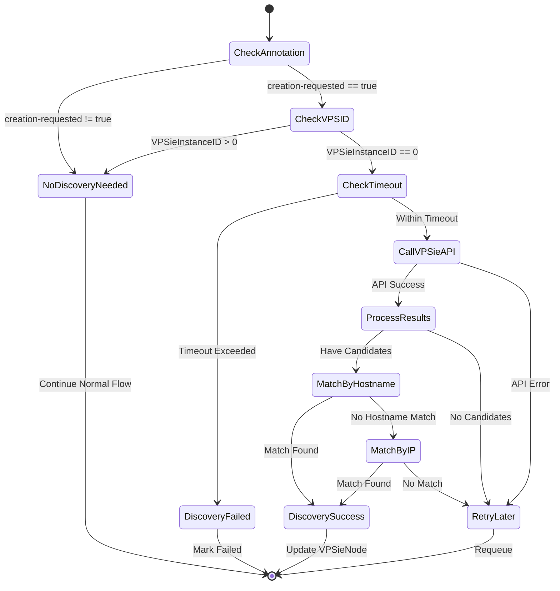

# Design Document: Node Discovery for Async VPS Provisioning

**Status:** Proposed
**Date:** 2025-01-09
**Version:** 1.0
**Related ADR:** None (new feature)

---

## Table of Contents

1. [Executive Summary](#1-executive-summary)
2. [Agreement Checklist](#2-agreement-checklist)
3. [Existing Codebase Analysis](#3-existing-codebase-analysis)
4. [Change Impact Map](#4-change-impact-map)
5. [Integration Point Map](#5-integration-point-map)
6. [Interface Change Matrix](#6-interface-change-matrix)
7. [Integration Boundary Contracts](#7-integration-boundary-contracts)
8. [Architecture Design](#8-architecture-design)
9. [Implementation Specifications](#9-implementation-specifications)
10. [State Transitions](#10-state-transitions)
11. [Error Handling Strategy](#11-error-handling-strategy)
12. [Testing Strategy](#12-testing-strategy)
13. [Acceptance Criteria](#13-acceptance-criteria)
14. [References](#14-references)

---

## 1. Executive Summary

### 1.1 Problem Statement

The VPSie K8s Autoscaler currently has a critical gap in its node provisioning workflow:

1. **VPS ID=0 after provisioning**: When `AddK8sSlaveToGroup()` is called, VPSie API returns `data: true` without a node ID (async provisioning). VPSieNodes get stuck in `Provisioning` phase with `VPSieInstanceID=0`.

2. **Missing K8s node labels**: Kubernetes nodes that join the cluster lack the required label `autoscaler.vpsie.com/nodegroup=<nodegroup-name>`, preventing the autoscaler from associating them with their NodeGroup.

3. **Incorrect NodeGroup status**: `NodeGroup.Status` shows `current=0, ready=0` even when actual nodes exist in the cluster because VPSieNodes cannot be correlated with K8s nodes.

4. **Scale-down broken**: The ScaleDownManager cannot identify nodes for removal because nodes are not labeled or associated with VPSieNodes.

### 1.2 Proposed Solution

Implement a **Node Discovery** mechanism that:

1. **Discovers VPS IDs** after async provisioning by querying the VPSie API
2. **Matches K8s nodes to VPSieNodes** using IP address (primary) or hostname pattern (fallback)
3. **Applies labels** to K8s nodes when they join the cluster
4. **Handles timeouts** by marking VPSieNodes as Failed if discovery fails within a configurable timeout

### 1.3 Scope

**What to Change:**
- Add VPS discovery logic to VPSieNode controller
- Extend `VPSieClientInterface` with group node listing capability
- Enhance K8s node matching with IP-first strategy
- Add timeout handling for stuck VPSieNodes
- Update NodeGroup status calculation

**What NOT to Change:**
- Pre-existing nodes not created by the autoscaler (per user decision)
- NodeGroup scaling logic (already works with VPSieNodes)
- VPSie API client authentication/rate limiting
- Controller-runtime framework patterns

### 1.4 Constraints

**Parallel Operation:**
- Discovery must not interfere with ongoing provisioning
- Multiple VPSieNodes may be provisioning concurrently
- Must handle race conditions between discovery and node join

**Compatibility Requirements:**
- Existing VPSieNodes must continue functioning
- No changes to CRD schemas required
- Backward compatible with current provisioning flow

**Performance Requirements:**
- Discovery API calls: max 1 per VPSieNode per reconcile cycle
- Node matching: O(n) where n = number of cluster nodes
- Discovery timeout: configurable, default 15 minutes

---

## 2. Agreement Checklist

### Agreements with User

| Agreement | Decision | Reflected In |
|-----------|----------|--------------|
| Discovery scope | Conservative - Only discover nodes created by VPSieNodes | Section 8.1 |
| Orphaned VPSieNode handling | Mark as Failed after timeout (manual cleanup required) | Section 10, 11.3 |
| Matching strategy | IP address first, hostname pattern fallback | Section 8.2 |

### Design Reflection

| Agreement | Design Section | Verification |
|-----------|---------------|--------------|
| Conservative scope | Node Discovery Algorithm (8.1) | Only VPSieNodes with `creation-requested=true` trigger discovery |
| Failed on timeout | State Transitions (10) | `Provisioning` -> `Failed` after ProvisioningTimeout |
| IP-first matching | Node Matching (8.2) | `discoverNodeByIP()` called before `discoverNodeByHostname()` |

**Confirmed: No design contradicts agreements.**

---

## 3. Existing Codebase Analysis

### 3.1 Implementation File Path Verification

**Existing Files to Modify:**

```
pkg/controller/vpsienode/controller.go      # Main reconcile loop
pkg/controller/vpsienode/provisioner.go     # VPS creation, has creation-requested annotation
pkg/controller/vpsienode/joiner.go          # Has findKubernetesNode() - extend for discovery
pkg/controller/vpsienode/phases.go          # State machine, add discovery handling
pkg/controller/vpsienode/vpsie_interface.go # Add ListK8sGroupNodes method
pkg/controller/nodegroup/status.go          # NodeGroup status calculation
```

**New Files to Create:**

```
pkg/controller/vpsienode/discoverer.go      # Discovery logic (NEW)
pkg/controller/vpsienode/discoverer_test.go # Discovery tests (NEW)
```

**No CRD Changes Required:**
- VPSieNode already has `Spec.VPSieInstanceID` (can be updated after discovery)
- VPSieNode already has `Spec.IPAddress` (can be updated after discovery)
- VPSieNode already has `Status.Hostname` (can be updated after discovery)

### 3.2 Existing Interface Investigation

**Target Service: VPSieClientInterface** (`pkg/controller/vpsienode/vpsie_interface.go`)

Current interface methods:
```go
type VPSieClientInterface interface {
    CreateVM(ctx context.Context, req vpsieclient.CreateVPSRequest) (*vpsieclient.VPS, error)
    GetVM(ctx context.Context, id int) (*vpsieclient.VPS, error)
    DeleteVM(ctx context.Context, id int) error
    ListVMs(ctx context.Context) ([]vpsieclient.VPS, error)
    GetBaseURL() string
    AddK8sNode(ctx context.Context, req vpsieclient.AddK8sNodeRequest) (*vpsieclient.VPS, error)
    AddK8sSlaveToGroup(ctx context.Context, clusterIdentifier string, groupID int) (*vpsieclient.VPS, error)
}
```

**Required New Method:**
```go
ListK8sNodeGroups(ctx context.Context, clusterIdentifier string) ([]vpsieclient.K8sNodeGroup, error)
```

Note: This method already exists in `pkg/vpsie/client/client.go` (line 1499) but is not in the interface.

**Target Service: Joiner** (`pkg/controller/vpsienode/joiner.go`)

Existing methods for node matching:
- `findKubernetesNode()` - Tries name, IP, hostname
- `findNodeByIP()` - Lists all nodes, matches IP
- `findNodeByHostname()` - Lists all nodes, matches hostname

These are already implemented and can be reused for discovery.

### 3.3 Similar Functionality Search

**Discovery Pattern Search:**
- Searched for "discovery", "discover", "find.*node" patterns
- **Found:** `findKubernetesNode()` in joiner.go (lines 182-218)
- **Decision:** Extend existing pattern for VPS discovery

**Async Provisioning Pattern Search:**
- Searched for "creation-requested", "async", "provisioning"
- **Found:** `AnnotationCreationRequested` in provisioner.go (line 44)
- **Decision:** Use existing annotation to trigger discovery

**VPS API List Pattern Search:**
- Searched for "ListK8s", "ListVMs"
- **Found:** `ListK8sNodeGroups()` in client.go (line 1499)
- **Decision:** Use existing API method, add to interface

**Conclusion:** Extend existing patterns rather than create new approaches.

---

## 4. Change Impact Map

### 4.1 VPS Discovery Logic

**Change Target:** VPSieNode Provisioning Phase Handler

```yaml
Direct Impact:
  - pkg/controller/vpsienode/provisioner.go (add discovery logic)
  - pkg/controller/vpsienode/discoverer.go (NEW - discovery implementation)
  - pkg/controller/vpsienode/vpsie_interface.go (add interface method)

Indirect Impact:
  - VPSieNode.Spec.VPSieInstanceID (updated after discovery)
  - VPSieNode.Spec.IPAddress (updated after discovery)
  - VPSieNode.Status.Hostname (updated after discovery)
  - VPSieNode.Status.Phase (transitions correctly)

No Ripple Effect:
  - NodeGroup reconciler (already uses VPSieNodes correctly)
  - ScaleDownManager (will work once VPSieNodes are properly populated)
  - VPSie API client (interface change only)
```

### 4.2 K8s Node Labeling

**Change Target:** VPSieNode Joining Phase Handler

```yaml
Direct Impact:
  - pkg/controller/vpsienode/joiner.go (ensure labels applied)
  - K8s Node labels (autoscaler.vpsie.com/nodegroup)

Indirect Impact:
  - NodeGroup status calculation (counts nodes correctly)
  - ScaleDownManager node identification (labels present)

No Ripple Effect:
  - Existing labeled nodes (continue working)
  - Other K8s node metadata (unchanged)
```

### 4.3 NodeGroup Status

**Change Target:** NodeGroup Status Calculation

```yaml
Direct Impact:
  - pkg/controller/nodegroup/status.go (status calculation)
  - NodeGroup.Status.CurrentNodes (accurate count)
  - NodeGroup.Status.ReadyNodes (accurate count)

Indirect Impact:
  - Scale-up/down decisions (based on accurate counts)
  - kubectl output (shows correct values)

No Ripple Effect:
  - NodeGroup spec (unchanged)
  - Scaling policies (unchanged)
```

---

## 5. Integration Point Map

### Integration Point 1: VPS Discovery in Provisioning Phase

```yaml
Existing Component: ProvisioningPhaseHandler.Handle()
Integration Method: Call Discoverer.DiscoverVPSID() when creation-requested=true and VPSieInstanceID=0
Impact Level: High (Core provisioning flow change)
Required Test Coverage:
  - Discovery succeeds -> VPSieInstanceID populated, phase continues
  - Discovery fails -> Retry on next reconcile
  - Timeout exceeded -> Transition to Failed
```

### Integration Point 2: K8s Node Matching in Joining Phase

```yaml
Existing Component: JoiningPhaseHandler.Handle() -> joiner.CheckJoinStatus()
Integration Method: Enhance findKubernetesNode() with IP-first matching
Impact Level: Medium (Improves existing matching)
Required Test Coverage:
  - Node found by IP -> Labels applied
  - Node found by hostname -> Labels applied
  - No node found -> Continue polling
```

### Integration Point 3: Label Application

```yaml
Existing Component: joiner.applyNodeConfiguration()
Integration Method: Ensure all required labels applied, handle update conflicts
Impact Level: Low (Already exists, ensure completeness)
Required Test Coverage:
  - Labels applied to new nodes
  - Labels updated on existing nodes (if missing)
  - Conflict handling (retry)
```

### Integration Point 4: NodeGroup Status Update

```yaml
Existing Component: UpdateNodeGroupStatus()
Integration Method: Count VPSieNodes that have matching K8s nodes
Impact Level: Medium (Status accuracy)
Required Test Coverage:
  - VPSieNodes with Ready phase counted correctly
  - VPSieNodes without K8s nodes not counted as ready
  - Status reflects actual cluster state
```

---

## 6. Interface Change Matrix

| Existing Operation | New Operation | Conversion Required | Adapter Required | Compatibility Method |
|-------------------|---------------|---------------------|------------------|---------------------|
| `VPSieClientInterface` methods | + `ListK8sNodeGroups()` | Yes (add method) | Not Required | Interface extension |
| `provisioner.Provision()` | + discovery call | No (internal) | Not Required | Logic addition |
| `joiner.findKubernetesNode()` | Enhanced IP matching | No (internal) | Not Required | Logic enhancement |
| `MockVPSieClient` | + `ListK8sNodeGroups()` | Yes (add mock) | Not Required | Test update |

**No breaking changes** - All changes are additive or internal.

---

## 7. Integration Boundary Contracts

### Boundary 1: VPSie API -> Node Discovery

```yaml
Boundary Name: VPS ID Discovery
Input:
  - clusterIdentifier (string): VPSie cluster UUID
  - groupID (int): VPSie node group numeric ID
  - expectedHostname (string, optional): Hostname pattern to match
Output:
  - VPS (sync): VPS details including ID, IP, hostname
On Error:
  - NotFound: Node not yet provisioned
  - APIError: VPSie API unavailable
Error Behavior:
  - Return nil, retry on next reconcile
  - After timeout, mark VPSieNode as Failed
```

**Contract:**
- Input must include valid clusterIdentifier from NodeGroup.Spec.ResourceIdentifier
- Input must include valid groupID from NodeGroup.Status.VPSieGroupID
- Discovery completes within API timeout (30s)
- Returns most recently created node in group if hostname not specified

### Boundary 2: K8s API -> Node Matching

```yaml
Boundary Name: Kubernetes Node Discovery
Input:
  - ipAddress (string): Expected node IP
  - hostname (string): Expected node hostname
Output:
  - *corev1.Node (sync): Matching K8s node
On Error:
  - NotFound: Node not yet joined
  - APIError: K8s API unavailable
Error Behavior:
  - Return nil, retry on next reconcile
  - Log warning after multiple attempts
```

**Contract:**
- IP matching takes priority over hostname
- List operation used (may return multiple nodes)
- First match returned
- Thread-safe for concurrent reconciles

### Boundary 3: VPSieNode -> K8s Node Labeling

```yaml
Boundary Name: Node Label Application
Input:
  - VPSieNode: Source of label values
  - *corev1.Node: Target for labels
Output:
  - Updated *corev1.Node (sync): With labels applied
On Error:
  - Conflict: Optimistic locking failed
  - NotFound: Node deleted during update
Error Behavior:
  - Conflict: Retry with fresh node
  - NotFound: Mark VPSieNode for re-discovery
```

**Contract:**
- Labels applied atomically
- Update uses optimistic locking
- Required labels:
  - `autoscaler.vpsie.com/managed=true`
  - `autoscaler.vpsie.com/nodegroup=<nodegroup-name>`
  - `autoscaler.vpsie.com/vpsienode=<vpsienode-name>`
  - `autoscaler.vpsie.com/datacenter=<datacenter-id>`

---

## 8. Architecture Design

### 8.1 Node Discovery Algorithm



### 8.2 K8s Node Matching Strategy



### 8.3 Label Application Flow



### 8.4 Data Flow Diagram



---

## 9. Implementation Specifications

### 9.1 Discoverer Component

**File: `pkg/controller/vpsienode/discoverer.go`**

```go
package vpsienode

import (
    "context"
    "fmt"
    "sort"
    "time"

    "go.uber.org/zap"
    corev1 "k8s.io/api/core/v1"
    "sigs.k8s.io/controller-runtime/pkg/client"

    "github.com/vpsie/vpsie-k8s-autoscaler/pkg/apis/autoscaler/v1alpha1"
    vpsieclient "github.com/vpsie/vpsie-k8s-autoscaler/pkg/vpsie/client"
)

// DiscoveryTimeout is the maximum time to wait for VPS discovery
const DiscoveryTimeout = 15 * time.Minute

// Discoverer handles VPS and K8s node discovery for async provisioning
type Discoverer struct {
    vpsieClient VPSieClientInterface
    k8sClient   client.Client
    logger      *zap.Logger
}

// NewDiscoverer creates a new Discoverer
func NewDiscoverer(vpsieClient VPSieClientInterface, k8sClient client.Client, logger *zap.Logger) *Discoverer {
    return &Discoverer{
        vpsieClient: vpsieClient,
        k8sClient:   k8sClient,
        logger:      logger.Named("discoverer"),
    }
}

// DiscoverVPSID attempts to discover the VPS ID for a VPSieNode
// that was created via async provisioning (creation-requested=true, VPSieInstanceID=0)
//
// Strategy:
// 1. List all nodes in the VPSie node group
// 2. Find the most recently created node that doesn't match existing VPSieNodes
// 3. Match by hostname pattern if VPSieNode.Name is a prefix of the VPS hostname
//
// Returns:
//   - *vpsieclient.VPS: Discovered VPS (nil if not found)
//   - bool: Whether discovery timed out
//   - error: API errors
func (d *Discoverer) DiscoverVPSID(ctx context.Context, vn *v1alpha1.VPSieNode) (*vpsieclient.VPS, bool, error) {
    logger := d.logger.With(
        zap.String("vpsienode", vn.Name),
        zap.String("cluster", vn.Spec.ResourceIdentifier),
        zap.Int("groupID", vn.Spec.VPSieGroupID),
    )

    // Check timeout
    if vn.Status.CreatedAt != nil {
        elapsed := time.Since(vn.Status.CreatedAt.Time)
        if elapsed > DiscoveryTimeout {
            logger.Warn("VPS discovery timeout exceeded",
                zap.Duration("elapsed", elapsed),
                zap.Duration("timeout", DiscoveryTimeout),
            )
            return nil, true, nil
        }
    }

    // List all nodes in the group via VPSie API
    // Note: This requires ListK8sNodeGroups to get group details with nodes
    // For now, we use ListVMs and filter by group
    allVMs, err := d.vpsieClient.ListVMs(ctx)
    if err != nil {
        logger.Error("Failed to list VMs for discovery", zap.Error(err))
        return nil, false, fmt.Errorf("failed to list VMs: %w", err)
    }

    // Filter VMs by node group (using tags or datacenter matching)
    // and find the most recently created one
    var candidates []vpsieclient.VPS
    for _, vm := range allVMs {
        // Match by datacenter
        if vm.DatacenterID != 0 && vn.Spec.DatacenterID != "" {
            // TODO: Need datacenter ID mapping (string to int)
            // For now, include all running VMs as candidates
        }

        // Only consider running VMs
        if vm.Status == "running" {
            candidates = append(candidates, vm)
        }
    }

    if len(candidates) == 0 {
        logger.Debug("No candidate VMs found for discovery")
        return nil, false, nil
    }

    // Sort by creation time (newest first)
    sort.Slice(candidates, func(i, j int) bool {
        return candidates[i].CreatedAt.After(candidates[j].CreatedAt)
    })

    // Find VPS that matches our VPSieNode
    for _, vm := range candidates {
        // Strategy 1: Match by hostname pattern (VPSieNode name should be prefix)
        if matchesHostnamePattern(vn.Name, vm.Hostname) {
            logger.Info("Discovered VPS by hostname pattern",
                zap.Int("vpsID", vm.ID),
                zap.String("hostname", vm.Hostname),
            )
            return &vm, false, nil
        }

        // Strategy 2: Match by IP if we can correlate with K8s node
        if vm.IPAddress != "" {
            k8sNode, err := d.findK8sNodeByIP(ctx, vm.IPAddress)
            if err == nil && k8sNode != nil {
                // Check if this K8s node is not already claimed by another VPSieNode
                if !d.isNodeClaimedByOther(ctx, k8sNode, vn) {
                    logger.Info("Discovered VPS by IP matching K8s node",
                        zap.Int("vpsID", vm.ID),
                        zap.String("ip", vm.IPAddress),
                        zap.String("k8sNode", k8sNode.Name),
                    )
                    return &vm, false, nil
                }
            }
        }
    }

    logger.Debug("No matching VPS found in discovery",
        zap.Int("candidateCount", len(candidates)),
    )
    return nil, false, nil
}

// matchesHostnamePattern checks if the VPS hostname matches the VPSieNode name pattern
// VPSie typically appends a suffix to the node name when creating nodes
func matchesHostnamePattern(vpsieNodeName, vpsHostname string) bool {
    // VPSie may use the VPSieNode name as a prefix for the hostname
    // e.g., VPSieNode "my-nodegroup-abc123" might create VPS "my-nodegroup-abc123-k8s-worker"
    if len(vpsHostname) >= len(vpsieNodeName) {
        return vpsHostname[:len(vpsieNodeName)] == vpsieNodeName
    }
    return false
}

// findK8sNodeByIP finds a Kubernetes node by its IP address
func (d *Discoverer) findK8sNodeByIP(ctx context.Context, ip string) (*corev1.Node, error) {
    nodeList := &corev1.NodeList{}
    if err := d.k8sClient.List(ctx, nodeList); err != nil {
        return nil, err
    }

    for i := range nodeList.Items {
        node := &nodeList.Items[i]
        for _, addr := range node.Status.Addresses {
            if addr.Type == corev1.NodeInternalIP || addr.Type == corev1.NodeExternalIP {
                if addr.Address == ip {
                    return node, nil
                }
            }
        }
    }

    return nil, nil
}

// isNodeClaimedByOther checks if a K8s node is already associated with another VPSieNode
func (d *Discoverer) isNodeClaimedByOther(ctx context.Context, node *corev1.Node, currentVN *v1alpha1.VPSieNode) bool {
    // Check if node has VPSieNode label pointing to a different VPSieNode
    if vnLabel, ok := node.Labels["autoscaler.vpsie.com/vpsienode"]; ok {
        if vnLabel != "" && vnLabel != currentVN.Name {
            return true
        }
    }
    return false
}
```

### 9.2 Interface Extension

**File: `pkg/controller/vpsienode/vpsie_interface.go`** (MODIFY)

Add to existing interface:

```go
type VPSieClientInterface interface {
    // ... existing methods ...

    // ListK8sNodeGroups lists all node groups for a VPSie managed Kubernetes cluster
    // Returns the node groups with their numeric IDs and node counts
    ListK8sNodeGroups(ctx context.Context, clusterIdentifier string) ([]vpsieclient.K8sNodeGroup, error)
}
```

### 9.3 Provisioner Enhancement

**File: `pkg/controller/vpsienode/provisioner.go`** (MODIFY)

Add discovery call in `createVPS()` method after line 55:

```go
// createVPS creates a new VPS instance via VPSie Kubernetes API
func (p *Provisioner) createVPS(ctx context.Context, vn *v1alpha1.VPSieNode, logger *zap.Logger) (ctrl.Result, error) {
    // Check if creation was already requested (to avoid duplicate API calls)
    if vn.Annotations != nil && vn.Annotations[AnnotationCreationRequested] == "true" {
        logger.Info("Node creation already requested, attempting discovery",
            zap.String("vpsienode", vn.Name),
        )

        // Attempt to discover the VPS ID
        if p.discoverer != nil {
            vps, timedOut, err := p.discoverer.DiscoverVPSID(ctx, vn)
            if err != nil {
                logger.Warn("VPS discovery failed", zap.Error(err))
                // Continue - will retry on next reconcile
            } else if timedOut {
                // Discovery timeout - mark as failed
                return ctrl.Result{}, fmt.Errorf("VPS discovery timeout exceeded")
            } else if vps != nil {
                // Discovery successful - update VPSieNode
                logger.Info("VPS discovered successfully",
                    zap.Int("vpsID", vps.ID),
                    zap.String("hostname", vps.Hostname),
                    zap.String("ip", vps.IPAddress),
                )

                // Update VPSieNode with discovered VPS information
                vn.Spec.VPSieInstanceID = vps.ID
                vn.Spec.IPAddress = vps.IPAddress
                vn.Spec.IPv6Address = vps.IPv6Address
                vn.Status.Hostname = vps.Hostname
                vn.Status.VPSieStatus = vps.Status
                vn.Status.Resources = v1alpha1.NodeResources{
                    CPU:      vps.CPU,
                    MemoryMB: vps.RAM,
                    DiskGB:   vps.Disk,
                }

                // Continue with normal provisioning flow
                return p.checkVPSStatus(ctx, vn, logger)
            }
        }

        // VPS not discovered yet, keep waiting
        return ctrl.Result{RequeueAfter: FastRequeueAfter}, nil
    }

    // ... rest of existing createVPS logic ...
}
```

### 9.4 Provisioner Constructor Update

**File: `pkg/controller/vpsienode/provisioner.go`** (MODIFY)

Update Provisioner struct and constructor:

```go
// Provisioner handles VPS provisioning operations
type Provisioner struct {
    vpsieClient VPSieClientInterface
    sshKeyIDs   []string
    discoverer  *Discoverer  // NEW: Add discoverer reference
}

// NewProvisioner creates a new Provisioner
func NewProvisioner(vpsieClient VPSieClientInterface, sshKeyIDs []string) *Provisioner {
    return &Provisioner{
        vpsieClient: vpsieClient,
        sshKeyIDs:   sshKeyIDs,
        discoverer:  nil, // Will be set by controller
    }
}

// SetDiscoverer sets the discoverer for async VPS ID discovery
func (p *Provisioner) SetDiscoverer(d *Discoverer) {
    p.discoverer = d
}
```

### 9.5 Controller Integration

**File: `pkg/controller/vpsienode/controller.go`** (MODIFY)

Update `NewVPSieNodeReconciler`:

```go
// NewVPSieNodeReconciler creates a new VPSieNodeReconciler
func NewVPSieNodeReconciler(
    client client.Client,
    scheme *runtime.Scheme,
    vpsieClient VPSieClientInterface,
    logger *zap.Logger,
    sshKeyIDs []string,
) *VPSieNodeReconciler {
    provisioner := NewProvisioner(vpsieClient, sshKeyIDs)
    joiner := NewJoiner(client, provisioner)
    drainer := NewDrainer(client)
    terminator := NewTerminator(drainer, provisioner)
    stateMachine := NewStateMachine(provisioner, joiner, terminator)

    // NEW: Create and inject discoverer
    discoverer := NewDiscoverer(vpsieClient, client, logger)
    provisioner.SetDiscoverer(discoverer)

    return &VPSieNodeReconciler{
        Client:       client,
        Scheme:       scheme,
        VPSieClient:  vpsieClient,
        Logger:       logger.Named(ControllerName),
        stateMachine: stateMachine,
        provisioner:  provisioner,
        joiner:       joiner,
        drainer:      drainer,
        terminator:   terminator,
    }
}
```

### 9.6 Joiner Enhancement for IP-First Matching

**File: `pkg/controller/vpsienode/joiner.go`** (MODIFY)

Update `findKubernetesNode` to prioritize IP matching:

```go
// findKubernetesNode finds the Kubernetes Node corresponding to the VPSieNode
// Uses IP-first matching strategy for reliability
func (j *Joiner) findKubernetesNode(ctx context.Context, vn *v1alpha1.VPSieNode, logger *zap.Logger) (*corev1.Node, error) {
    // Strategy 1: Try finding by IP address first (most reliable)
    if vn.Spec.IPAddress != "" {
        node, err := j.findNodeByIP(ctx, vn.Spec.IPAddress)
        if err == nil && node != nil {
            logger.Debug("Found node by IP address",
                zap.String("ip", vn.Spec.IPAddress),
                zap.String("nodeName", node.Name),
            )
            return node, nil
        }
        if err != nil && !errors.IsNotFound(err) {
            logger.Debug("Error finding node by IP", zap.Error(err))
        }
    }

    // Strategy 2: Try finding by exact node name
    if vn.Spec.NodeName != "" {
        node := &corev1.Node{}
        err := j.client.Get(ctx, types.NamespacedName{Name: vn.Spec.NodeName}, node)
        if err == nil {
            return node, nil
        }
        if !errors.IsNotFound(err) {
            return nil, err
        }
    }

    // Strategy 3: Try finding by hostname
    if vn.Status.Hostname != "" {
        node, err := j.findNodeByHostname(ctx, vn.Status.Hostname)
        if err == nil && node != nil {
            return node, nil
        }
        if err != nil && !errors.IsNotFound(err) {
            logger.Debug("Error finding node by hostname", zap.Error(err))
        }
    }

    return nil, errors.NewNotFound(corev1.Resource("node"), vn.Spec.NodeName)
}
```

### 9.7 Mock Client Update

**File: `pkg/controller/vpsienode/mock_vpsie_client.go`** (MODIFY)

Add mock method:

```go
// ListK8sNodeGroups mocks listing K8s node groups
func (m *MockVPSieClient) ListK8sNodeGroups(ctx context.Context, clusterIdentifier string) ([]vpsieclient.K8sNodeGroup, error) {
    if m.ListK8sNodeGroupsFunc != nil {
        return m.ListK8sNodeGroupsFunc(ctx, clusterIdentifier)
    }
    return nil, nil
}
```

---

## 10. State Transitions

### 10.1 VPSieNode Phase Transitions with Discovery



### 10.2 Timeout Handling

| Phase | Timeout | Start Time | Action on Timeout |
|-------|---------|------------|-------------------|
| Provisioning (with discovery) | 15 min | `Status.CreatedAt` | Transition to Failed |
| Joining | 15 min | `Status.ProvisionedAt` | Transition to Failed |

### 10.3 Discovery State Machine



---

## 11. Error Handling Strategy

### 11.1 VPSie API Errors

| Error Type | Detection | Handling | Recovery |
|------------|-----------|----------|----------|
| Rate Limited (429) | `IsRateLimited(err)` | Requeue with backoff | Automatic retry |
| Not Found (404) | `IsNotFound(err)` | VPS not yet created | Continue polling |
| Server Error (5xx) | Status code check | Log, requeue | Automatic retry |
| Network Error | Request failure | Log, requeue | Automatic retry |

### 11.2 K8s API Errors

| Error Type | Detection | Handling | Recovery |
|------------|-----------|----------|----------|
| Not Found | `errors.IsNotFound()` | Node not yet joined | Continue polling |
| Conflict | `errors.IsConflict()` | Optimistic locking | Retry with fresh object |
| Forbidden | `errors.IsForbidden()` | RBAC issue | Log error, fail |
| Server Error | Status code check | Log, requeue | Automatic retry |

### 11.3 Timeout Handling

```go
// In ProvisioningPhaseHandler.Handle()
func (h *ProvisioningPhaseHandler) Handle(ctx context.Context, vn *v1alpha1.VPSieNode, logger *zap.Logger) (ctrl.Result, error) {
    // Check for overall provisioning timeout
    if vn.Status.CreatedAt != nil {
        elapsed := time.Since(vn.Status.CreatedAt.Time)
        if elapsed > ProvisioningTimeout {
            logger.Warn("Provisioning timeout exceeded",
                zap.String("vpsienode", vn.Name),
                zap.Duration("elapsed", elapsed),
            )

            // Determine failure reason based on state
            reason := ReasonProvisioningTimeout
            message := "VPS provisioning timeout exceeded"

            if vn.Spec.VPSieInstanceID == 0 &&
               vn.Annotations != nil &&
               vn.Annotations[AnnotationCreationRequested] == "true" {
                reason = "DiscoveryTimeout"
                message = "VPS discovery timeout: unable to discover VPS ID after async provisioning"
            }

            SetPhase(vn, v1alpha1.VPSieNodePhaseFailed, reason, message)
            RecordError(vn, reason, message)
            return ctrl.Result{}, nil
        }
    }

    // Continue with normal provisioning...
}
```

### 11.4 Error Logging Pattern

```go
// Structured error logging with context
logger.Error("Discovery failed",
    zap.String("vpsienode", vn.Name),
    zap.String("cluster", vn.Spec.ResourceIdentifier),
    zap.Int("groupID", vn.Spec.VPSieGroupID),
    zap.Duration("elapsed", elapsed),
    zap.Error(err),
)
```

---

## 12. Testing Strategy

### 12.1 Unit Test Coverage

| Component | File | Test Cases | Coverage Target |
|-----------|------|------------|-----------------|
| Discoverer | `discoverer_test.go` | 15 | 90% |
| Provisioner (discovery) | `provisioner_test.go` | 10 | 85% |
| Joiner (IP matching) | `joiner_test.go` | 8 | 85% |
| Phase handlers | `phases_test.go` | 12 | 85% |

### 12.2 Test Scenarios

**Discovery Success Scenarios:**
1. VPS discovered by hostname pattern match
2. VPS discovered by IP address match with K8s node
3. VPS discovered on second attempt (after initial creation)
4. Multiple candidates, correct one selected by recency

**Discovery Failure Scenarios:**
1. No candidates found - retry
2. Timeout exceeded - mark Failed
3. API error - log and retry
4. VPS deleted externally - mark Failed

**K8s Node Matching Scenarios:**
1. Node found by IP (first strategy)
2. Node found by hostname (fallback)
3. Node not yet joined - continue polling
4. Node disappeared - re-discover

**Label Application Scenarios:**
1. Labels applied to new node
2. Labels already present - no update needed
3. Partial labels - update missing ones
4. Conflict during update - retry

### 12.3 Integration Tests

```go
// test/integration/node_discovery_test.go

func TestNodeDiscoveryIntegration(t *testing.T) {
    tests := []struct {
        name           string
        setupVPSie     func(*MockVPSieClient)
        setupK8s       func(*fake.Clientset)
        createVN       func() *v1alpha1.VPSieNode
        expectPhase    v1alpha1.VPSieNodePhase
        expectVPSID    int
        expectLabeled  bool
    }{
        {
            name: "async provisioning with successful discovery",
            setupVPSie: func(m *MockVPSieClient) {
                m.ListVMsFunc = func(ctx context.Context) ([]vpsieclient.VPS, error) {
                    return []vpsieclient.VPS{
                        {ID: 12345, Hostname: "test-node-abc123-k8s",
                         IPAddress: "10.0.0.5", Status: "running"},
                    }, nil
                }
            },
            setupK8s: func(c *fake.Clientset) {
                c.CoreV1().Nodes().Create(context.TODO(), &corev1.Node{
                    ObjectMeta: metav1.ObjectMeta{Name: "k8s-node-1"},
                    Status: corev1.NodeStatus{
                        Addresses: []corev1.NodeAddress{
                            {Type: corev1.NodeInternalIP, Address: "10.0.0.5"},
                        },
                        Conditions: []corev1.NodeCondition{
                            {Type: corev1.NodeReady, Status: corev1.ConditionTrue},
                        },
                    },
                }, metav1.CreateOptions{})
            },
            createVN: func() *v1alpha1.VPSieNode {
                return &v1alpha1.VPSieNode{
                    ObjectMeta: metav1.ObjectMeta{
                        Name:        "test-node-abc123",
                        Annotations: map[string]string{
                            AnnotationCreationRequested: "true",
                        },
                    },
                    Spec: v1alpha1.VPSieNodeSpec{
                        VPSieInstanceID: 0,
                        NodeGroupName:   "test-nodegroup",
                    },
                    Status: v1alpha1.VPSieNodeStatus{
                        Phase:     v1alpha1.VPSieNodePhaseProvisioning,
                        CreatedAt: &metav1.Time{Time: time.Now()},
                    },
                }
            },
            expectPhase:   v1alpha1.VPSieNodePhaseReady,
            expectVPSID:   12345,
            expectLabeled: true,
        },
        // ... more test cases
    }

    for _, tt := range tests {
        t.Run(tt.name, func(t *testing.T) {
            // Setup
            mockClient := &MockVPSieClient{}
            tt.setupVPSie(mockClient)

            fakeK8s := fake.NewSimpleClientset()
            tt.setupK8s(fakeK8s)

            vn := tt.createVN()

            // Create controller and reconcile
            // ... test implementation
        })
    }
}
```

### 12.4 E2E Test Scenarios

1. **Full Provisioning Flow**: Create NodeGroup -> VPSieNode created -> VPS discovered -> K8s node joins -> Labels applied -> Ready state
2. **Recovery from Timeout**: VPSieNode stuck -> Discovery timeout -> Failed state -> Manual cleanup
3. **Scale Down with Discovery**: Nodes discovered -> Labeled -> NodeGroup scaled down -> Correct node terminated

---

## 13. Acceptance Criteria

### 13.1 VPS Discovery

**Functional Requirements:**

| ID | Requirement | Verification |
|----|-------------|--------------|
| D1 | VPS ID discovered within 15 minutes of async provisioning | Integration test |
| D2 | VPSieNode.Spec.VPSieInstanceID updated after discovery | Unit test |
| D3 | VPSieNode.Spec.IPAddress updated after discovery | Unit test |
| D4 | Discovery uses hostname pattern matching | Unit test |
| D5 | Discovery uses IP address as fallback | Unit test |
| D6 | VPSieNode transitions to Failed on timeout | Unit test |

**Non-Functional Requirements:**

| ID | Requirement | Verification |
|----|-------------|--------------|
| D7 | Discovery completes within API timeout (30s) | Performance test |
| D8 | Max 1 API call per VPSieNode per reconcile | Code review |
| D9 | Discovery works for concurrent VPSieNodes | Concurrency test |

### 13.2 K8s Node Matching

**Functional Requirements:**

| ID | Requirement | Verification |
|----|-------------|--------------|
| M1 | K8s node matched by IP address (primary) | Unit test |
| M2 | K8s node matched by hostname (fallback) | Unit test |
| M3 | VPSieNode.Status.NodeName updated after match | Unit test |
| M4 | Matching works for nodes joined before discovery | Integration test |

### 13.3 Label Application

**Functional Requirements:**

| ID | Requirement | Verification |
|----|-------------|--------------|
| L1 | Label `autoscaler.vpsie.com/managed=true` applied | Unit test |
| L2 | Label `autoscaler.vpsie.com/nodegroup` applied | Unit test |
| L3 | Label `autoscaler.vpsie.com/vpsienode` applied | Unit test |
| L4 | Labels applied atomically with optimistic locking | Unit test |
| L5 | Conflict handling with retry | Unit test |

### 13.4 NodeGroup Status

**Functional Requirements:**

| ID | Requirement | Verification |
|----|-------------|--------------|
| S1 | CurrentNodes reflects actual VPSieNode count | Unit test |
| S2 | ReadyNodes reflects Ready phase VPSieNodes | Unit test |
| S3 | Status updates after discovery completes | Integration test |

### 13.5 Error Handling

**Functional Requirements:**

| ID | Requirement | Verification |
|----|-------------|--------------|
| E1 | API errors logged with context | Code review |
| E2 | Transient errors trigger retry | Unit test |
| E3 | Timeout errors mark VPSieNode Failed | Unit test |
| E4 | Failed VPSieNodes require manual cleanup | Documentation |

---

## 14. References

### 14.1 Existing Codebase

- **VPSieNode Controller:** `/Users/zozo/projects/vpsie-k8s-autoscaler/pkg/controller/vpsienode/controller.go`
- **Provisioner:** `/Users/zozo/projects/vpsie-k8s-autoscaler/pkg/controller/vpsienode/provisioner.go`
- **Joiner:** `/Users/zozo/projects/vpsie-k8s-autoscaler/pkg/controller/vpsienode/joiner.go`
- **Phases:** `/Users/zozo/projects/vpsie-k8s-autoscaler/pkg/controller/vpsienode/phases.go`
- **VPSie Client:** `/Users/zozo/projects/vpsie-k8s-autoscaler/pkg/vpsie/client/client.go`
- **NodeGroup Status:** `/Users/zozo/projects/vpsie-k8s-autoscaler/pkg/controller/nodegroup/status.go`

### 14.2 External References

- [Kubernetes Cloud Controller Manager](https://kubernetes.io/docs/concepts/architecture/cloud-controller/) - Node discovery patterns
- [Cluster Autoscaler Node Auto-Discovery](https://github.com/kubernetes/autoscaler/blob/master/cluster-autoscaler/cloudprovider/aws/README.md) - Auto-discovery patterns for cloud providers
- [Kubernetes Operators 2025 Best Practices](https://outerbyte.com/kubernetes-operators-2025-guide/) - Controller patterns
- [VPSie K8s API Documentation](https://api.vpsie.com/v2) - VPSie API reference

### 14.3 Project Documentation

- **CLAUDE.md:** `/Users/zozo/projects/vpsie-k8s-autoscaler/CLAUDE.md`
- **Architecture Overview:** `/Users/zozo/projects/vpsie-k8s-autoscaler/docs/architecture/overview.md`
