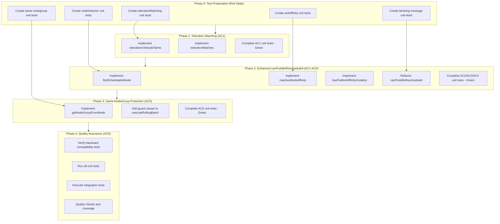
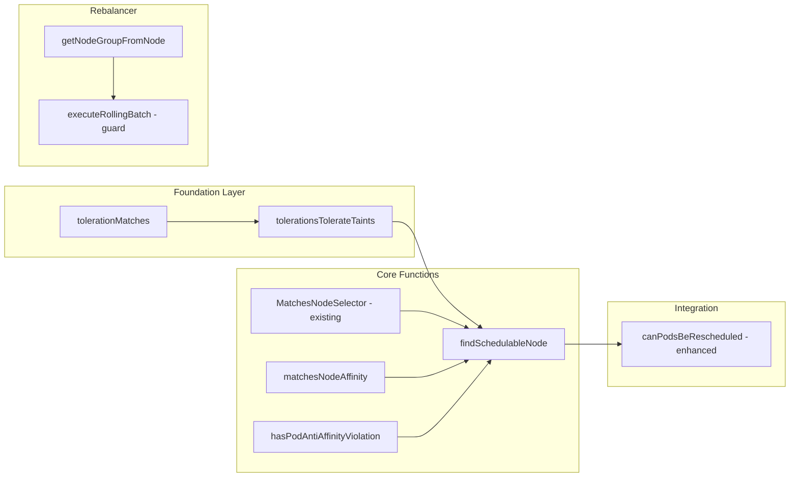

# Work Plan: Enhanced Scale-Down Safety Implementation

Created Date: 2026-01-11
Type: feature
Estimated Duration: 2-3 days
Estimated Impact: 4 files
Related Issue/PR: N/A

## Related Documents
- Design Doc: [docs/design/enhanced-scale-down-safety-design.md](/Users/zozo/projects/vpsie-k8s-autoscaler/docs/design/enhanced-scale-down-safety-design.md)
- ADR: None (establishes new pattern for scheduling constraint handling)
- PRD: None

## Objective
Enhance the VPSie Kubernetes Autoscaler's scale-down safety mechanism to perform per-pod scheduling simulation before node removal. The current implementation only checks aggregate resource capacity, which can lead to workload disruption when pods with special scheduling constraints (tolerations, nodeSelector, affinity) cannot be rescheduled to remaining nodes.

## Background
The current `canPodsBeRescheduled()` function in `pkg/scaler/safety.go`:
1. Only checks aggregate CPU/memory capacity with 20% buffer
2. Does NOT check per-pod tolerations against node taints
3. Does NOT verify per-pod nodeSelector matches (helper exists but is unused)
4. Does NOT simulate actual scheduling per pod

Additionally, the rebalancer's `TerminateNode()` lacks protection against same-nodegroup operations that cause unnecessary churn.

## Phase Structure Diagram



## Task Dependency Diagram



## Risks and Countermeasures

### Technical Risks
- **Risk**: Performance degradation with large clusters (100+ nodes, 1000+ pods)
  - **Impact**: Medium - Scale-down checks could exceed 5-second target
  - **Countermeasure**: Implement fail-fast on first non-schedulable pod; cache node pods; short-circuit on node match

- **Risk**: Edge cases in Kubernetes toleration matching semantics
  - **Impact**: Medium - Incorrect blocking or allowing of scale-down
  - **Countermeasure**: Follow Kubernetes official documentation precisely; test wildcard tolerations; test effect matching

- **Risk**: Existing safety_test.go tests could break
  - **Impact**: High - Regression in existing functionality
  - **Countermeasure**: Run existing tests first; ensure backward compatibility (AC6); modify tests only if behavior intentionally changes

### Schedule Risks
- **Risk**: Anti-affinity implementation more complex than estimated
  - **Impact**: Low - Could extend Phase 2 by 0.5 days
  - **Countermeasure**: Focus on required (hard) anti-affinity only; defer preferred (soft) constraints

## Implementation Phases

### Phase 0: Test Preparation (Red State) (Estimated commits: 1)
**Purpose**: Implement test skeletons to establish Red state for TDD approach (unit tests only)

**Test Resolution Progress**: 0/12 unit tests resolved

#### Tasks
- [ ] Task 1: Complete `TestTolerationMatching` test implementations in `safety_test.go`
  - AC1 blocked scenario test
  - AC1 allowed scenario test
  - AC1 wildcard toleration test
- [ ] Task 2: Complete `TestNodeSelectorInCanPodsBeRescheduled` test implementations
  - AC2 blocked scenario test
  - AC2 allowed scenario test
- [ ] Task 3: Complete `TestAntiAffinityVerification` test implementations
  - AC3 blocked scenario test
  - AC3 allowed scenario test
- [ ] Task 4: Complete `TestClearBlockingMessages` test implementation (AC4)
- [ ] Task 5: Complete `TestSameNodeGroupProtection` test implementations in `executor_test.go`
  - AC5 skip scenario test
  - AC5 different nodegroup test
  - AC5 same nodegroup different offering test
- [ ] Quality check: Verify all new tests fail with expected errors (Red state)

#### Phase Completion Criteria
- [ ] All 12 new unit test skeletons implemented with concrete assertions
- [ ] Tests compile successfully
- [ ] Tests fail with meaningful "not implemented" errors (Red state verified)

#### Operational Verification Procedures
1. Run `go test ./pkg/scaler -run "TestTolerationMatching|TestNodeSelectorInCanPodsBeRescheduled|TestAntiAffinityVerification|TestClearBlockingMessages" -v` - expect failures
2. Run `go test ./pkg/rebalancer -run "TestSameNodeGroupProtection" -v` - expect failures
3. Verify failure messages indicate missing function implementations

---

### Phase 1: Toleration Matching Implementation (AC1) (Estimated commits: 2)
**Purpose**: Implement Kubernetes-compliant toleration matching algorithm

**Test Resolution Progress**: 3/12 unit tests resolved

#### Tasks
- [ ] Task 1: Implement `tolerationMatches(toleration *corev1.Toleration, taint *corev1.Taint) bool`
  - Handle empty key with Exists operator (wildcard)
  - Handle key matching
  - Handle effect matching (empty toleration effect matches all)
  - Handle Equal and Exists operators
- [ ] Task 2: Implement `tolerationMatchesTaint(tolerations []corev1.Toleration, taint *corev1.Taint) bool`
  - Iterate tolerations to find match
- [ ] Task 3: Implement `tolerationsTolerateTaints(tolerations []corev1.Toleration, taints []corev1.Taint) bool`
  - Only check NoSchedule and NoExecute effects (hard constraints)
  - Skip PreferNoSchedule (soft constraint)
- [ ] Task 4: Complete AC1 unit tests (Green state)
- [ ] Quality check: Run `go test ./pkg/scaler -run TestTolerationMatching -v`

#### Phase Completion Criteria
- [ ] `tolerationsTolerateTaints` correctly identifies toleration/taint mismatches
- [ ] All 3 AC1 unit tests pass (Green state)
- [ ] Wildcard toleration (empty key + Exists) matches any taint
- [ ] PreferNoSchedule taints are correctly ignored

#### Operational Verification Procedures
1. Run `go test ./pkg/scaler -run TestTolerationMatching -v` - all 3 tests pass
2. Verify test coverage for toleration functions: `go test ./pkg/scaler -cover -run TestTolerationMatching`
3. Manual verification with edge cases:
   - Empty tolerations list against node with NoSchedule taint -> false
   - Toleration with matching key/value/effect -> true
   - Toleration with Exists operator (any value) -> true

---

### Phase 2: Enhanced canPodsBeRescheduled (AC1-AC4) (Estimated commits: 3)
**Purpose**: Implement per-pod scheduling simulation with full constraint checking

**Test Resolution Progress**: 9/12 unit tests resolved

#### Tasks
- [ ] Task 1: Implement `matchesNodeAffinity(pod *corev1.Pod, node *corev1.Node) bool`
  - Check RequiredDuringSchedulingIgnoredDuringExecution only
  - Skip PreferredDuringScheduling (soft constraint)
- [ ] Task 2: Implement `matchesNodeSelectorTerms(node *corev1.Node, terms []corev1.NodeSelectorTerm) bool`
  - Support MatchExpressions with In, NotIn, Exists, DoesNotExist, Gt, Lt operators
- [ ] Task 3: Implement `hasPodAntiAffinityViolation(pod *corev1.Pod, node *corev1.Node, existingPods []*corev1.Pod) bool`
  - Check RequiredDuringSchedulingIgnoredDuringExecution only
  - Match labelSelector against existing pods
  - Respect topologyKey for node matching
- [ ] Task 4: Implement `matchesPodAffinityTerm(existingPod *corev1.Pod, term *corev1.PodAffinityTerm, node *corev1.Node) bool`
- [ ] Task 5: Implement `findSchedulableNode(pod *corev1.Pod, nodes []*corev1.Node, nodePodsCache map[string][]*corev1.Pod) (bool, *corev1.Node)`
  - Check tolerations first (cheapest)
  - Check nodeSelector second
  - Check nodeAffinity third
  - Check podAntiAffinity last (most expensive)
  - Return first viable node
- [ ] Task 6: Implement `buildNodePodsCache(ctx context.Context, nodes []*corev1.Node) map[string][]*corev1.Pod`
  - Cache pods per node for anti-affinity checks
- [ ] Task 7: Refactor `canPodsBeRescheduled(ctx context.Context, pods []*corev1.Pod) (bool, string, error)`
  - Get remaining schedulable nodes
  - Build nodePodsCache
  - For each pod: call findSchedulableNode
  - Skip DaemonSet pods (use existing `isSkippableDaemonSetPod`)
  - Return detailed reason on failure (AC4)
- [ ] Task 8: Complete AC2, AC3, AC4 unit tests (Green state)
- [ ] Quality check: Run `go test ./pkg/scaler -run "TestNodeSelector|TestAntiAffinity|TestClearBlockingMessages" -v`

#### Phase Completion Criteria
- [ ] All 6 new unit tests pass (AC2: 2, AC3: 2, AC4: 1, plus implicit AC1 integration)
- [ ] `findSchedulableNode` checks all constraints in performance-optimized order
- [ ] Blocking reason messages include pod name, namespace, and constraint type
- [ ] Existing `MatchesNodeSelector` helper is now actively used

#### Operational Verification Procedures
1. Run `go test ./pkg/scaler -run "TestNodeSelector|TestAntiAffinity|TestClearBlockingMessages" -v` - all 6 tests pass
2. Run full scaler tests: `go test ./pkg/scaler/... -v` - verify no regressions
3. Verify error messages contain actionable information:
   - Pod namespace/name: "pod myapp/web-abc123"
   - Constraint type: "no node tolerates taint" or "no suitable node found"
4. Performance check (manual): Verify constraint check order in code matches Design Doc (tolerations -> nodeSelector -> affinity -> anti-affinity)

---

### Phase 3: Same-NodeGroup Protection (AC5) (Estimated commits: 2)
**Purpose**: Prevent rebalancer from terminating nodes when target nodegroup equals source nodegroup with same offering

**Test Resolution Progress**: 12/12 unit tests resolved

#### Tasks
- [ ] Task 1: Implement `getNodeGroupFromNode(ctx context.Context, nodeName string) string`
  - Get node from Kubernetes API
  - Return value of label `autoscaler.vpsie.com/nodegroup`
  - Return empty string on error (fail-safe)
- [ ] Task 2: Add guard clause to `executeRollingBatch` before provisioning
  - Check if `currentNodeGroup == plan.NodeGroupName && candidate.CurrentOffering == candidate.TargetOffering`
  - Log info message: "Skipping termination: same nodegroup and offering"
  - Continue to next candidate (skip, don't fail)
- [ ] Task 3: Add same guard to `executeSurgeBatch` (consistency)
- [ ] Task 4: Complete AC5 unit tests (Green state)
- [ ] Quality check: Run `go test ./pkg/rebalancer -run TestSameNodeGroupProtection -v`

#### Phase Completion Criteria
- [ ] All 3 AC5 unit tests pass (Green state)
- [ ] Same-nodegroup with same offering skipped silently with info log
- [ ] Same-nodegroup with different offering proceeds (right-sizing use case)
- [ ] Different nodegroup always proceeds

#### Operational Verification Procedures
1. Run `go test ./pkg/rebalancer -run TestSameNodeGroupProtection -v` - all 3 tests pass
2. Run full rebalancer tests: `go test ./pkg/rebalancer/... -v` - verify no regressions
3. Verify log output indicates skip reason (manual code review or log capture in test)
4. Verify VPSie API is not called for skipped nodes (mock verification in tests)

---

### Phase 4: Quality Assurance (AC6) (Estimated commits: 1)
**Purpose**: Verify backward compatibility, run all tests, and ensure Design Doc compliance

#### Tasks
- [ ] Task 1: Verify `TestBackwardCompatibility` test passes (AC6)
  - Simple pods without constraints scale down normally
  - Existing `TestIsSafeToRemove` tests pass unchanged
- [ ] Task 2: Run all existing safety_test.go tests
  - `TestIsSingleInstanceSystemPod`
  - `TestIsNodeReady`
  - `TestHasPersistentVolumes`
  - `TestIsPodControlledBy`
  - `TestHasNodeSelector`
  - `TestHasNodeAffinity`
  - `TestGetPodPriority`
  - `TestIsSystemCriticalPod`
  - `TestMatchesNodeSelector`
  - `TestHasPodsWithLocalStorage`
  - `TestHasUniqueSystemPods`
  - `TestIsSafeToRemove`
- [ ] Task 3: Execute integration tests
  - `TestScaleDownSafetyWithSchedulingConstraints` (AC1, AC2, AC5)
  - `TestScaleDownSafetyBackwardCompatibility` (AC6)
- [ ] Task 4: Quality checks
  - Run `make lint` - zero errors
  - Run `make fmt` - no changes
  - Run `go vet ./pkg/scaler/... ./pkg/rebalancer/...` - no warnings
- [ ] Task 5: Test coverage verification
  - Run `go test ./pkg/scaler -cover` - target 80%+ for safety.go
  - Run `go test ./pkg/rebalancer -cover` - target 70%+ for executor.go
- [ ] Task 6: Build verification
  - Run `make build` - success

#### Phase Completion Criteria
- [ ] All existing unit tests pass (backward compatibility verified)
- [ ] All new unit tests pass (12/12 resolved)
- [ ] Integration tests pass (4 tests)
- [ ] Lint, format, vet checks pass with zero issues
- [ ] Test coverage meets thresholds
- [ ] Build completes successfully

#### Operational Verification Procedures
(Copied from Design Doc)

```bash
# Unit Test Verification (L2)
go test ./pkg/scaler -run TestTolerationMatching -v
go test ./pkg/scaler -run TestEnhancedCanPodsBeRescheduled -v
go test ./pkg/rebalancer -run TestSameNodeGroupProtection -v

# Integration Test Verification (L2)
go test -tags=integration ./test/integration -run TestScaleDownWithTolerations -v
go test -tags=integration ./test/integration -run TestScaleDownWithNodeSelector -v

# Full Test Suite
make test

# Quality Checks
make lint
make fmt
go vet ./...

# Build Verification
make build
```

---

## Quality Checklist

- [ ] Design Doc consistency verification
- [ ] Phase composition based on technical dependencies
- [ ] All requirements converted to tasks
- [ ] Quality assurance exists in final phase
- [ ] E2E verification procedures placed at integration points
- [ ] Test design information reflected
  - [ ] Setup tasks placed appropriately
  - [ ] Risk level-based prioritization applied (high complexity tests implemented carefully)
  - [ ] AC and test case traceability specified (12 unit tests, 4 integration tests)
  - [ ] Quantitative test resolution progress indicators set for each phase

## Acceptance Criteria Traceability

| AC | Description | Unit Tests | Integration Tests | Phase |
|----|-------------|------------|-------------------|-------|
| AC1 | Toleration matching | 3 tests | 1 test | Phase 1-2 |
| AC2 | NodeSelector matching | 2 tests | 1 test | Phase 2 |
| AC3 | Anti-affinity verification | 2 tests | - | Phase 2 |
| AC4 | Clear blocking messages | 1 test | - | Phase 2 |
| AC5 | Same-nodegroup protection | 3 tests | 1 test | Phase 3 |
| AC6 | Backward compatibility | 1 test | 1 test | Phase 4 |
| **Total** | | **12 tests** | **4 tests** | |

## Completion Criteria
- [ ] All phases completed
- [ ] Each phase's operational verification procedures executed
- [ ] Design Doc acceptance criteria satisfied (AC1-AC6)
- [ ] Staged quality checks completed (zero errors)
- [ ] All tests pass (12 unit + 4 integration)
- [ ] Necessary documentation updated (CLAUDE.md if patterns change)
- [ ] User review approval obtained

## Progress Tracking

### Phase 0: Test Preparation
- Start: YYYY-MM-DD HH:MM
- Complete: YYYY-MM-DD HH:MM
- Notes:

### Phase 1: Toleration Matching
- Start: YYYY-MM-DD HH:MM
- Complete: YYYY-MM-DD HH:MM
- Notes:

### Phase 2: Enhanced canPodsBeRescheduled
- Start: YYYY-MM-DD HH:MM
- Complete: YYYY-MM-DD HH:MM
- Notes:

### Phase 3: Same-NodeGroup Protection
- Start: YYYY-MM-DD HH:MM
- Complete: YYYY-MM-DD HH:MM
- Notes:

### Phase 4: Quality Assurance
- Start: YYYY-MM-DD HH:MM
- Complete: YYYY-MM-DD HH:MM
- Notes:

## Notes

### Implementation Order Rationale
The phases are ordered based on technical dependencies identified in the Design Doc:
1. **Toleration matching** is foundational - required by findSchedulableNode
2. **findSchedulableNode** depends on toleration matching plus existing MatchesNodeSelector
3. **Anti-affinity** depends on findSchedulableNode for node iteration
4. **Same-nodegroup protection** is independent and can be implemented in parallel

### Test-Driven Development Approach
- Phase 0 establishes Red state with concrete test assertions
- Each subsequent phase moves specific tests from Red to Green
- Integration tests execute at Phase 4 once all unit functionality is complete

### Performance Considerations
- Constraint check order follows computational cost: tolerations (O(n)) -> nodeSelector (O(1)) -> affinity (O(1)) -> anti-affinity (O(n*m))
- Node pods cache built once per canPodsBeRescheduled call
- Fail-fast on first non-schedulable pod

### Files Modified

| File | Changes | Lines (est.) |
|------|---------|--------------|
| `pkg/scaler/safety.go` | Add toleration matching, findSchedulableNode, refactor canPodsBeRescheduled | +150 |
| `pkg/scaler/safety_test.go` | Complete 9 test skeletons | +200 |
| `pkg/rebalancer/executor.go` | Add getNodeGroupFromNode, guard clause | +30 |
| `pkg/rebalancer/executor_test.go` | Complete 3 test skeletons | +80 |
