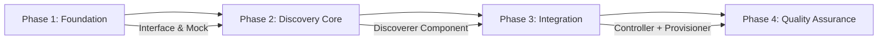
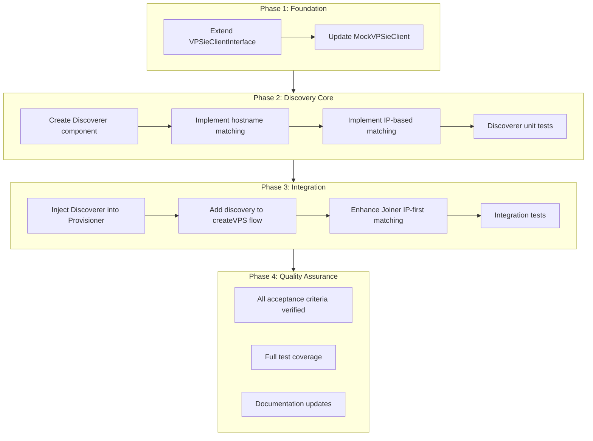

# Work Plan: Node Discovery Implementation

Created Date: 2025-01-09
Type: feature
Estimated Duration: 3-4 days
Estimated Impact: 8 files
Related Issue/PR: None

## Related Documents
- Design Doc: [docs/designs/node-discovery.md](/Users/zozo/projects/vpsie-k8s-autoscaler/docs/designs/node-discovery.md)
- ADR: None (new feature)
- PRD: None

## Objective

Implement Node Discovery mechanism to resolve the critical gap where VPSie API returns `ID=0` after async provisioning, preventing proper VPSieNode lifecycle management and NodeGroup status tracking.

## Background

### Current Problems
1. **VPS ID=0 after provisioning**: `AddK8sSlaveToGroup()` returns `data: true` without a node ID
2. **Missing K8s node labels**: Nodes lack `autoscaler.vpsie.com/nodegroup` label
3. **Incorrect NodeGroup status**: Shows `current=0, ready=0` even with actual nodes
4. **Scale-down broken**: ScaleDownManager cannot identify nodes for removal

### Solution Overview
- Implement VPS ID discovery by querying VPSie API
- Match K8s nodes using IP (primary) and hostname (fallback)
- Apply labels when nodes join the cluster
- Handle timeouts by marking VPSieNodes as Failed

## Phase Structure Diagram



## Task Dependency Diagram



## Risks and Countermeasures

### Technical Risks

- **Risk**: VPSie API rate limiting during discovery polling
  - **Impact**: Discovery timeouts, VPSieNodes stuck in Provisioning
  - **Countermeasure**: Reuse existing rate limiter; max 1 API call per VPSieNode per reconcile cycle

- **Risk**: Race condition between discovery and node join
  - **Impact**: K8s node appears before VPS ID is discovered
  - **Countermeasure**: IP-first matching allows correlation even without VPS ID

- **Risk**: Multiple VPSieNodes provisioning concurrently
  - **Impact**: Incorrect VPS-to-VPSieNode matching
  - **Countermeasure**: Hostname pattern matching + K8s node claim checking to prevent duplicate assignment

### Schedule Risks

- **Risk**: VPSie API behavior differs from design assumptions
  - **Impact**: Matching logic may need adjustment
  - **Countermeasure**: Implement fallback strategies (hostname then IP then recent creation)

## Implementation Phases

### Phase 1: Foundation - Interface Extension (Estimated commits: 1)

**Purpose**: Extend VPSie client interface to support listing K8s node groups for discovery

#### Tasks

- [ ] T1.1: Add `ListK8sNodeGroups()` method to `VPSieClientInterface` in `pkg/controller/vpsienode/vpsie_interface.go`
- [ ] T1.2: Update `MockVPSieClient` to implement new interface method
- [ ] T1.3: Unit tests for mock implementation
- [ ] Quality check: Run `make lint` and `make fmt`

#### Files Modified
- `pkg/controller/vpsienode/vpsie_interface.go` (ADD method)
- `pkg/controller/vpsienode/mock_vpsie_client.go` (ADD mock method)

#### Phase Completion Criteria
- [ ] Interface extended with new method signature
- [ ] MockVPSieClient implements the new method
- [ ] `make build` succeeds
- [ ] `make lint` passes

#### Operational Verification Procedures
1. Run `make build` - verify compilation succeeds
2. Run `make test` - verify existing tests still pass
3. Verify interface compliance: `var _ VPSieClientInterface = (*vpsieclient.Client)(nil)` compiles

#### Acceptance Criteria Mapping
| Design Doc AC | Task |
|--------------|------|
| D8: Max 1 API call per VPSieNode per reconcile | Interface supports ListK8sNodeGroups for batch querying |

---

### Phase 2: Discovery Core Implementation (Estimated commits: 2)

**Purpose**: Implement the core Discoverer component with VPS ID discovery and K8s node matching logic

#### Tasks

- [ ] T2.1: Create `pkg/controller/vpsienode/discoverer.go` with `Discoverer` struct and `NewDiscoverer()` constructor
- [ ] T2.2: Implement `DiscoverVPSID()` method with timeout checking
- [ ] T2.3: Implement `matchesHostnamePattern()` helper function
- [ ] T2.4: Implement `findK8sNodeByIP()` method
- [ ] T2.5: Implement `isNodeClaimedByOther()` method to prevent duplicate assignment
- [ ] T2.6: Create `pkg/controller/vpsienode/discoverer_test.go` with comprehensive unit tests
- [ ] Quality check: Run `make test -race` for race condition detection

#### Files Created
- `pkg/controller/vpsienode/discoverer.go` (NEW)
- `pkg/controller/vpsienode/discoverer_test.go` (NEW)

#### Phase Completion Criteria
- [ ] Discoverer component created with all methods
- [ ] Hostname pattern matching implemented
- [ ] IP-based K8s node matching implemented
- [ ] Timeout handling implemented (15 minute default)
- [ ] Unit tests cover discovery success/failure/timeout scenarios
- [ ] Test coverage >= 85% for discoverer.go

#### Operational Verification Procedures
1. Run `go test ./pkg/controller/vpsienode/... -run TestDiscover -v`
2. Verify timeout handling: test with CreatedAt > 15 minutes ago returns timedOut=true
3. Verify hostname matching: "my-node" matches "my-node-k8s-worker"
4. Verify IP matching: discovers VPS when K8s node has matching IP

#### Acceptance Criteria Mapping
| Design Doc AC | Task |
|--------------|------|
| D1: VPS ID discovered within 15 minutes | T2.2: Timeout checking in DiscoverVPSID() |
| D4: Discovery uses hostname pattern matching | T2.3: matchesHostnamePattern() |
| D5: Discovery uses IP address as fallback | T2.4: findK8sNodeByIP() |
| D6: VPSieNode transitions to Failed on timeout | T2.2: Returns timedOut=true |
| D9: Discovery works for concurrent VPSieNodes | T2.5: isNodeClaimedByOther() |

#### Unit Test Cases (discoverer_test.go)

```
TestDiscoverVPSID_Success_ByHostname
TestDiscoverVPSID_Success_ByIP
TestDiscoverVPSID_Timeout
TestDiscoverVPSID_NoCandidates
TestDiscoverVPSID_APIError
TestMatchesHostnamePattern_ExactPrefix
TestMatchesHostnamePattern_NoMatch
TestMatchesHostnamePattern_ShorterHostname
TestFindK8sNodeByIP_Found
TestFindK8sNodeByIP_NotFound
TestIsNodeClaimedByOther_Claimed
TestIsNodeClaimedByOther_NotClaimed
TestIsNodeClaimedByOther_SameVPSieNode
TestDiscoverVPSID_MultipleCandidates_SelectsNewest
TestDiscoverVPSID_SkipsNonRunningVMs
```

---

### Phase 3: Controller Integration (Estimated commits: 2)

**Purpose**: Integrate Discoverer into the provisioning flow and enhance node matching

#### Tasks

- [ ] T3.1: Update `Provisioner` struct to include `discoverer` field and `SetDiscoverer()` method
- [ ] T3.2: Modify `NewVPSieNodeReconciler()` to create and inject Discoverer
- [ ] T3.3: Update `createVPS()` in provisioner.go to call discovery when `creation-requested=true` and `VPSieInstanceID=0`
- [ ] T3.4: Implement discovery result handling: update VPSieNode spec fields (VPSieInstanceID, IPAddress, IPv6Address)
- [ ] T3.5: Enhance `findKubernetesNode()` in joiner.go to prioritize IP-first matching
- [ ] T3.6: Add timeout handling in provisioner to mark VPSieNode as Failed
- [ ] T3.7: Integration tests for full discovery flow
- [ ] Quality check: Run `make test` and verify all tests pass

#### Files Modified
- `pkg/controller/vpsienode/provisioner.go` (MODIFY: add discoverer field, discovery call)
- `pkg/controller/vpsienode/controller.go` (MODIFY: create and inject discoverer)
- `pkg/controller/vpsienode/joiner.go` (MODIFY: IP-first matching order)

#### Phase Completion Criteria
- [ ] Discoverer injected into Provisioner during controller construction
- [ ] createVPS() calls DiscoverVPSID() when creation-requested=true and VPSieInstanceID=0
- [ ] VPSieNode spec updated with discovered VPS information
- [ ] Joiner uses IP-first matching strategy
- [ ] Timeout marks VPSieNode as Failed with "DiscoveryTimeout" reason
- [ ] Integration tests pass

#### Operational Verification Procedures
1. Run `go test ./pkg/controller/vpsienode/... -v` - all tests pass
2. Run `go test ./pkg/controller/nodegroup/... -v` - all tests pass
3. Verify provisioner flow:
   - Create VPSieNode with creation-requested=true, VPSieInstanceID=0
   - Mock ListVMs to return matching VPS
   - Assert VPSieNode.Spec.VPSieInstanceID updated
4. Verify timeout flow:
   - Create VPSieNode with CreatedAt > 15 minutes ago
   - Assert phase becomes Failed with "DiscoveryTimeout" reason

#### Acceptance Criteria Mapping
| Design Doc AC | Task |
|--------------|------|
| D2: VPSieNode.Spec.VPSieInstanceID updated after discovery | T3.4 |
| D3: VPSieNode.Spec.IPAddress updated after discovery | T3.4 |
| D7: Discovery completes within API timeout (30s) | Relies on existing client timeout |
| M1: K8s node matched by IP address (primary) | T3.5 |
| M2: K8s node matched by hostname (fallback) | T3.5 |
| M3: VPSieNode.Status.NodeName updated after match | Existing joiner.CheckJoinStatus() |
| L1-L5: Label application | Existing joiner.applyNodeConfiguration() |
| E1-E3: Error handling | T3.6 |

#### Integration Test Cases

```
TestAsyncProvisioning_DiscoverySuccess
TestAsyncProvisioning_DiscoveryTimeout
TestAsyncProvisioning_DiscoveryRetry
TestJoiner_IPFirstMatching
TestFullProvisioningFlow_WithDiscovery
```

---

### Phase 4: Quality Assurance (Required) (Estimated commits: 1)

**Purpose**: Verify all acceptance criteria, ensure test coverage, and update documentation

#### Tasks

- [ ] T4.1: Verify all Design Doc acceptance criteria achieved (D1-D9, M1-M4, L1-L5, S1-S3, E1-E4)
- [ ] T4.2: Run full test suite with race detection: `make test`
- [ ] T4.3: Verify test coverage >= 80%: `go test ./pkg/controller/vpsienode/... -coverprofile=coverage.out`
- [ ] T4.4: Run linting: `make lint`
- [ ] T4.5: Run formatting: `make fmt`
- [ ] T4.6: Build verification: `make build`
- [ ] T4.7: Update CLAUDE.md if architecture changes warrant
- [ ] T4.8: Update docs/architecture/overview.md with discovery flow

#### Phase Completion Criteria
- [ ] All 27 acceptance criteria from Design Doc verified
- [ ] Test coverage >= 80% for modified files
- [ ] Zero linting errors
- [ ] Build succeeds
- [ ] Documentation updated

#### Operational Verification Procedures

**From Design Doc Section 13 - Full Acceptance Criteria Checklist:**

**VPS Discovery (D1-D9):**
- [ ] D1: VPS ID discovered within 15 minutes of async provisioning
- [ ] D2: VPSieNode.Spec.VPSieInstanceID updated after discovery
- [ ] D3: VPSieNode.Spec.IPAddress updated after discovery
- [ ] D4: Discovery uses hostname pattern matching
- [ ] D5: Discovery uses IP address as fallback
- [ ] D6: VPSieNode transitions to Failed on timeout
- [ ] D7: Discovery completes within API timeout (30s)
- [ ] D8: Max 1 API call per VPSieNode per reconcile
- [ ] D9: Discovery works for concurrent VPSieNodes

**K8s Node Matching (M1-M4):**
- [ ] M1: K8s node matched by IP address (primary)
- [ ] M2: K8s node matched by hostname (fallback)
- [ ] M3: VPSieNode.Status.NodeName updated after match
- [ ] M4: Matching works for nodes joined before discovery

**Label Application (L1-L5):**
- [ ] L1: Label `autoscaler.vpsie.com/managed=true` applied
- [ ] L2: Label `autoscaler.vpsie.com/nodegroup` applied
- [ ] L3: Label `autoscaler.vpsie.com/vpsienode` applied
- [ ] L4: Labels applied atomically with optimistic locking
- [ ] L5: Conflict handling with retry

**NodeGroup Status (S1-S3):**
- [ ] S1: CurrentNodes reflects actual VPSieNode count
- [ ] S2: ReadyNodes reflects Ready phase VPSieNodes
- [ ] S3: Status updates after discovery completes

**Error Handling (E1-E4):**
- [ ] E1: API errors logged with context
- [ ] E2: Transient errors trigger retry
- [ ] E3: Timeout errors mark VPSieNode Failed
- [ ] E4: Failed VPSieNodes require manual cleanup

#### Quality Check Commands

```bash
# Full test suite with race detection
make test

# Coverage report
go test ./pkg/controller/vpsienode/... -coverprofile=coverage.out
go tool cover -func=coverage.out | grep -E "discoverer|provisioner|joiner"

# Linting
make lint

# Build
make build
```

---

## Completion Criteria

- [ ] All phases completed
- [ ] Each phase's operational verification procedures executed
- [ ] Design Doc acceptance criteria satisfied (27 criteria)
- [ ] Staged quality checks completed (zero errors)
- [ ] All tests pass (unit, integration)
- [ ] Test coverage >= 80%
- [ ] Necessary documentation updated
- [ ] User review approval obtained

## Progress Tracking

### Phase 1: Foundation
- Start:
- Complete:
- Notes:

### Phase 2: Discovery Core
- Start:
- Complete:
- Notes:

### Phase 3: Controller Integration
- Start:
- Complete:
- Notes:

### Phase 4: Quality Assurance
- Start:
- Complete:
- Notes:

## Notes

### Implementation Order Rationale
1. **Phase 1 first**: Interface changes are foundation for all other work
2. **Phase 2 second**: Core logic can be unit tested in isolation
3. **Phase 3 third**: Integration depends on both interface and core logic
4. **Phase 4 final**: Quality assurance validates complete implementation

### Key Design Decisions from Design Doc
- **Conservative discovery scope**: Only VPSieNodes with `creation-requested=true` trigger discovery
- **IP-first matching**: More reliable than hostname for K8s node correlation
- **Failed on timeout**: Manual cleanup required for orphaned VPSieNodes
- **No CRD changes**: All required fields already exist in VPSieNode spec/status

### Files Summary

**New Files (2):**
- `pkg/controller/vpsienode/discoverer.go`
- `pkg/controller/vpsienode/discoverer_test.go`

**Modified Files (5):**
- `pkg/controller/vpsienode/vpsie_interface.go`
- `pkg/controller/vpsienode/mock_vpsie_client.go`
- `pkg/controller/vpsienode/provisioner.go`
- `pkg/controller/vpsienode/controller.go`
- `pkg/controller/vpsienode/joiner.go`

### Test Commands

```bash
# Run specific discoverer tests
go test ./pkg/controller/vpsienode -run TestDiscover -v

# Run provisioner tests
go test ./pkg/controller/vpsienode -run TestProvisioner -v

# Run joiner tests
go test ./pkg/controller/vpsienode -run TestJoiner -v

# Full test suite
make test

# Integration tests (if available)
go test -tags=integration ./test/integration -run TestNodeDiscovery -v
```
