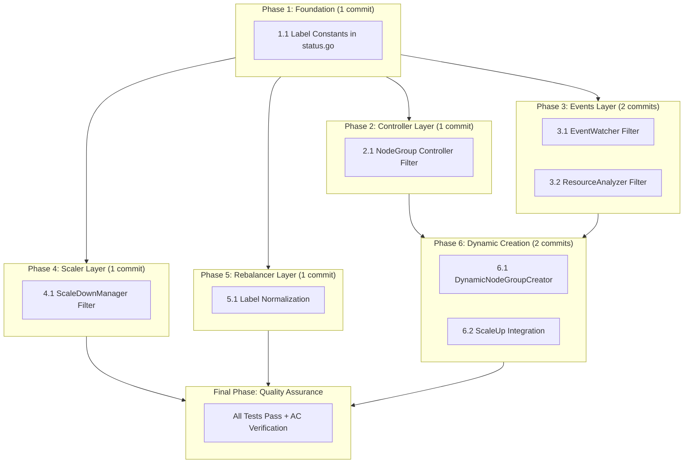
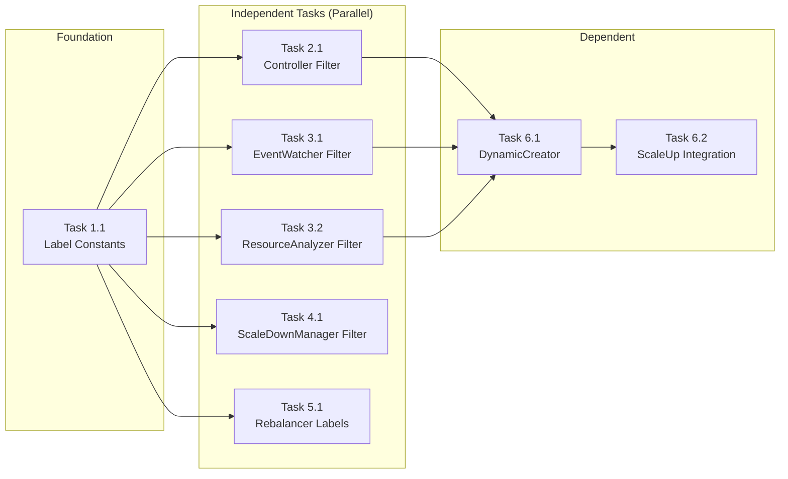

# Work Plan: NodeGroup Isolation Implementation

Created Date: 2026-01-10
Type: feature
Estimated Duration: 3-4 days
Estimated Impact: 8 files (6 modified, 2 new)
Related Issue/PR: N/A

## Related Documents
- Design Doc: [docs/plans/nodegroup-isolation-design.md](/Users/zozo/projects/vpsie-k8s-autoscaler/docs/plans/nodegroup-isolation-design.md)
- ADR: None (filtering feature, not architecture change)
- PRD: None

## Objective

Implement NodeGroup isolation so the autoscaler only manages NodeGroups explicitly marked with `autoscaler.vpsie.com/managed=true` label. This enables multi-tenant safety, clear ownership boundaries, and dynamic NodeGroup creation when no suitable managed NodeGroup exists.

## Background

The current autoscaler manages ALL NodeGroup CRs in the cluster regardless of origin. Key issues:

1. **Label Mismatch**: The managed label exists in `GetNodeGroupLabels()` but is only applied to VPSieNodes, not to the parent NodeGroup CR
2. **Inconsistent Label Selectors**: Rebalancer uses `vpsie.io/nodegroup` while scaler uses `autoscaler.vpsie.com/nodegroup`
3. **No Filtering**: `GetNodeGroups()` returns ALL NodeGroups without filtering
4. **No Dynamic Creation**: Pods remain unscheduled if no suitable managed NodeGroup exists

## Phase Structure Diagram



## Task Dependency Diagram



## Risks and Countermeasures

### Technical Risks

- **Risk**: Existing users' NodeGroups become unmanaged after upgrade
  - **Impact**: High - autoscaler stops working for existing NodeGroups
  - **Countermeasure**: Clear documentation, release notes warning, log warning when no managed NodeGroups found

- **Risk**: Label selector inconsistency between rebalancer and scaler
  - **Impact**: Medium - rebalancer may operate on wrong nodes
  - **Countermeasure**: Task 5.1 explicitly normalizes all label selectors to use `autoscaler.vpsie.com/*` namespace

- **Risk**: Dynamic NodeGroup creation creates too many NodeGroups
  - **Impact**: Medium - resource exhaustion
  - **Countermeasure**: Implement rate limiting in DynamicNodeGroupCreator

### Schedule Risks

- **Risk**: Test coverage requirements may extend timeline
  - **Impact**: Low - each phase has clear test requirements
  - **Countermeasure**: Write tests alongside implementation (TDD approach)

## Implementation Phases

### Phase 1: Foundation - Label Constants (Estimated commits: 1)

**Purpose**: Establish centralized label constants and helper functions that all other components depend on

#### Tasks

- [x] **Task 1.1**: Add centralized label constants and helpers to `pkg/controller/nodegroup/status.go`
  - Add `ManagedLabelKey = "autoscaler.vpsie.com/managed"` constant
  - Add `ManagedLabelValue = "true"` constant
  - Add `NodeGroupNameLabelKey = "autoscaler.vpsie.com/nodegroup"` constant
  - Add `IsManagedNodeGroup(ng *v1alpha1.NodeGroup) bool` helper function
  - Add `SetNodeGroupManaged(ng *v1alpha1.NodeGroup)` helper function
  - Add `ManagedLabelSelector() client.MatchingLabels` helper function
  - Unit tests for all helper functions

#### Files to Modify
- `pkg/controller/nodegroup/status.go`

#### Phase Completion Criteria
- [ ] All constants exported and documented
- [ ] `IsManagedNodeGroup()` returns true only when label `autoscaler.vpsie.com/managed=true` exists
- [ ] `IsManagedNodeGroup()` returns false for nil labels map
- [ ] `ManagedLabelSelector()` returns correct `client.MatchingLabels`
- [ ] Unit tests pass: `go test ./pkg/controller/nodegroup/... -run TestIsManagedNodeGroup -v`

#### Operational Verification Procedures
1. Run `go test ./pkg/controller/nodegroup/... -v` - all tests pass
2. Run `go build ./...` - no compilation errors
3. Verify constants are accessible from other packages

---

### Phase 2: Controller Layer (Estimated commits: 1)

**Purpose**: Filter NodeGroups in the main reconciliation loop to only process managed NodeGroups

#### Tasks

- [ ] **Task 2.1**: Add managed label filter to NodeGroup controller
  - Modify `secretToNodeGroups()` in `controller.go` to use `ManagedLabelSelector()` when listing NodeGroups
  - Add early return in `Reconcile()` if NodeGroup lacks managed label (with debug log)
  - Integration test verifying unmanaged NodeGroups are skipped

#### Files to Modify
- `pkg/controller/nodegroup/controller.go`

#### Dependencies
- Phase 1 must be complete (label constants required)

#### Phase Completion Criteria
- [ ] `secretToNodeGroups()` uses `client.MatchingLabels{ManagedLabelKey: ManagedLabelValue}` in List call
- [ ] Reconciler skips NodeGroups without managed label
- [ ] Debug log emitted when skipping unmanaged NodeGroup
- [ ] Unit tests pass: `go test ./pkg/controller/nodegroup/... -v`

#### Operational Verification Procedures
1. Run `go test ./pkg/controller/nodegroup/... -v` - all tests pass
2. Manual verification in local cluster:
   - Create NodeGroup without managed label - verify it is ignored
   - Create NodeGroup with `autoscaler.vpsie.com/managed=true` - verify it is processed

---

### Phase 3: Events Layer (Estimated commits: 2)

**Purpose**: Filter NodeGroups in EventWatcher and ResourceAnalyzer for scale-up decisions

#### Tasks

- [ ] **Task 3.1**: Add managed label filter to EventWatcher
  - Modify `GetNodeGroups()` in `watcher.go` to apply `ManagedLabelSelector()` filter
  - Add INFO log showing count of managed NodeGroups found
  - Unit test verifying only managed NodeGroups returned

- [ ] **Task 3.2**: Add managed label filter to ResourceAnalyzer
  - Modify `FindMatchingNodeGroups()` in `analyzer.go` to check `IsManagedNodeGroup()` in loop
  - Skip unmanaged NodeGroups with debug log
  - Unit test verifying unmanaged NodeGroups excluded from matches

#### Files to Modify
- `pkg/events/watcher.go`
- `pkg/events/analyzer.go`

#### Dependencies
- Phase 1 must be complete (label constants required)

#### Phase Completion Criteria
- [ ] `GetNodeGroups()` returns only NodeGroups with managed label
- [ ] `FindMatchingNodeGroups()` skips unmanaged NodeGroups
- [ ] INFO log: "Filtering NodeGroups by managed label, found N managed NodeGroups"
- [ ] Unit tests pass: `go test ./pkg/events/... -v`

#### Operational Verification Procedures
1. Run `go test ./pkg/events/... -v` - all tests pass
2. Verify import of nodegroup package works correctly
3. Check for any circular dependency issues

---

### Phase 4: Scaler Layer (Estimated commits: 1)

**Purpose**: Ensure ScaleDownManager only considers nodes from managed NodeGroups

#### Tasks

- [ ] **Task 4.1**: Verify and document ScaleDownManager filtering
  - Review `getNodeGroupNodes()` in `scaler.go` - currently filters by `autoscaler.vpsie.com/nodegroup={name}`
  - This is already correct as it operates on specific NodeGroups passed from controller
  - Add comment documenting the filtering behavior
  - Verify no changes needed (controller-level filtering is sufficient)
  - Add integration test: ScaleDownManager only receives candidates from managed NodeGroups

#### Files to Modify
- `pkg/scaler/scaler.go` (comment/documentation only)

#### Dependencies
- Phase 1 must be complete
- Phase 2 must be complete (controller filtering ensures only managed NodeGroups reach ScaleDownManager)

#### Phase Completion Criteria
- [ ] Documented that ScaleDownManager relies on controller-level filtering
- [ ] Comment added to `getNodeGroupNodes()` explaining the filter
- [ ] Existing tests pass: `go test ./pkg/scaler/... -v`

#### Operational Verification Procedures
1. Run `go test ./pkg/scaler/... -v` - all tests pass
2. Code review confirms filtering chain is correct

---

### Phase 5: Rebalancer Layer (Estimated commits: 1)

**Purpose**: Normalize label selectors in rebalancer to use consistent `autoscaler.vpsie.com/*` namespace

#### Tasks

- [ ] **Task 5.1**: Normalize rebalancer label selectors
  - Modify `getNodeGroupNodes()` in `analyzer.go` to use `autoscaler.vpsie.com/nodegroup` instead of `vpsie.io/nodegroup`
  - Modify node label reading to use `autoscaler.vpsie.com/offering` instead of `vpsie.io/offering`
  - Add managed label check at entry point of `AnalyzeRebalanceOpportunities()`
  - Unit test verifying correct label selector

#### Files to Modify
- `pkg/rebalancer/analyzer.go`

#### Dependencies
- Phase 1 must be complete (label constants required)

#### Phase Completion Criteria
- [ ] `getNodeGroupNodes()` uses `autoscaler.vpsie.com/nodegroup` label selector
- [ ] Node offering read from `autoscaler.vpsie.com/offering` label
- [ ] `AnalyzeRebalanceOpportunities()` checks `IsManagedNodeGroup()` and returns early if false
- [ ] Unit tests pass: `go test ./pkg/rebalancer/... -v`

#### Operational Verification Procedures
1. Run `go test ./pkg/rebalancer/... -v` - all tests pass
2. Verify no references to `vpsie.io/*` labels remain in rebalancer package

---

### Phase 6: Dynamic NodeGroup Creation (Estimated commits: 2)

**Purpose**: Create new managed NodeGroups when no suitable one exists for pending pods

#### Tasks

- [ ] **Task 6.1**: Implement DynamicNodeGroupCreator
  - Create new file `pkg/events/creator.go`
  - Implement `DynamicNodeGroupCreator` struct with client, logger, default template
  - Implement `CreateNodeGroupForPod(ctx, pod, namespace) (*NodeGroup, error)`
  - Implement `FindSuitableNodeGroup(ctx, pod, nodeGroups) *NodeGroup`
  - Generated NodeGroup name format: `auto-{datacenter}-{timestamp}`
  - Always apply `autoscaler.vpsie.com/managed=true` label
  - Unit tests for creation logic

- [ ] **Task 6.2**: Integrate DynamicCreator with ScaleUpController
  - Modify `HandleScaleUp()` in `scaleup.go` to use DynamicNodeGroupCreator
  - If no suitable managed NodeGroup exists, create one dynamically
  - Scale the newly created NodeGroup
  - Integration test for dynamic creation flow

#### Files to Create
- `pkg/events/creator.go`
- `pkg/events/creator_test.go`

#### Files to Modify
- `pkg/events/scaleup.go`

#### Dependencies
- Phase 1 must be complete (label constants required)
- Phase 2 must be complete (controller must process dynamically created NodeGroups)
- Phase 3 must be complete (EventWatcher filter must return empty for no managed NodeGroups)

#### Phase Completion Criteria
- [ ] `DynamicNodeGroupCreator` creates NodeGroups with managed label
- [ ] Created NodeGroups have unique, predictable names
- [ ] `HandleScaleUp()` creates NodeGroup when no suitable one exists
- [ ] Created NodeGroup is immediately used for scale-up
- [ ] Unit tests pass: `go test ./pkg/events/... -v`

#### Operational Verification Procedures
1. Run `go test ./pkg/events/... -v` - all tests pass
2. E2E verification:
   - Deploy pending pod with no matching managed NodeGroup
   - Verify new NodeGroup created with managed label
   - Verify pod eventually scheduled on new NodeGroup's node

---

### Final Phase: Quality Assurance (Required) (Estimated commits: 1)

**Purpose**: Verify all acceptance criteria from Design Doc are met

#### Tasks

- [ ] Verify all Design Doc acceptance criteria achieved
  - FR1: NodeGroup controller filters by managed label
  - FR1: All listing operations apply managed label selector
  - FR1: NodeGroups without label are skipped without error
  - FR2: ScaleDownManager only considers managed NodeGroup nodes
  - FR2: EventWatcher only matches against managed NodeGroups
  - FR2: Rebalancer only analyzes managed NodeGroups
  - FR3: Dynamic NodeGroup creation when no suitable exists
  - FR3: Created NodeGroups have managed label
  - FR4: Suitability matching respects resource requirements
- [ ] Quality checks pass
  - `go fmt ./...`
  - `go vet ./...`
  - `golangci-lint run`
- [ ] Execute all tests
  - `make test` passes
  - All unit tests pass
  - All integration tests pass
- [ ] Coverage verification (target: 70%+)
- [ ] Documentation updates
  - Update CLAUDE.md if needed
  - Add example managed NodeGroup YAML to docs

#### Operational Verification Procedures (from Design Doc)

**Integration Point 1: Label Helper -> All Components**
```bash
# Verify label constants accessible from all packages
go build ./pkg/controller/nodegroup/...
go build ./pkg/events/...
go build ./pkg/scaler/...
go build ./pkg/rebalancer/...
```

**Integration Point 2: Controller Filter -> Reconciliation**
```bash
# Integration test with mixed managed/unmanaged NodeGroups
go test ./test/integration/... -run TestReconciler_SkipsUnmanagedNodeGroups -v
```

**Integration Point 3: EventWatcher Filter -> Scale-Up**
```bash
# E2E test with pending pods and managed NodeGroup
go test ./test/e2e/... -run TestScaleUp_WithManagedNodeGroup -v
```

**Integration Point 4: Dynamic Creator -> NodeGroup Creation**
```bash
# E2E test with pending pods and no suitable managed NodeGroup
go test ./test/e2e/... -run TestDynamicCreation_WhenNoSuitableExists -v
```

### Quality Assurance
- [ ] Implement staged quality checks (details: refer to ai-development-guide skill)
- [ ] All tests pass (`make test`)
- [ ] Static check pass (`go vet ./...`)
- [ ] Lint check pass (`golangci-lint run`)
- [ ] Build success (`make build`)

## Completion Criteria

- [ ] All phases completed
- [ ] Each phase's operational verification procedures executed
- [ ] Design Doc acceptance criteria satisfied:
  - [ ] FR1.1: NodeGroup controller only processes managed NodeGroups
  - [ ] FR1.2: All listing operations apply managed label selector
  - [ ] FR1.3: Unmanaged NodeGroups skipped without error
  - [ ] FR2.1: ScaleDownManager filters by managed NodeGroups
  - [ ] FR2.2: EventWatcher matches only managed NodeGroups
  - [ ] FR2.3: Rebalancer analyzes only managed NodeGroups
  - [ ] FR3.1: Dynamic NodeGroup creation works
  - [ ] FR3.2: Dynamic NodeGroups have managed label
  - [ ] FR4.1: Suitability matching respects requirements
- [ ] Staged quality checks completed (zero errors)
- [ ] All tests pass
- [ ] Necessary documentation updated
- [ ] User review approval obtained

## Progress Tracking

### Phase 1: Foundation
- Start: 2026-01-10
- Complete: 2026-01-10
- Notes: Task 1.1 completed. Added label constants (ManagedLabelKey, ManagedLabelValue, NodeGroupNameLabelKey) and helper functions (IsManagedNodeGroup, SetNodeGroupManaged, ManagedLabelSelector) with full unit test coverage.

### Phase 2: Controller Layer
- Start: _____
- Complete: _____
- Notes: _____

### Phase 3: Events Layer
- Start: _____
- Complete: _____
- Notes: _____

### Phase 4: Scaler Layer
- Start: _____
- Complete: _____
- Notes: _____

### Phase 5: Rebalancer Layer
- Start: _____
- Complete: _____
- Notes: _____

### Phase 6: Dynamic Creation
- Start: _____
- Complete: _____
- Notes: _____

### Final Phase: Quality Assurance
- Start: _____
- Complete: _____
- Notes: _____

## Atomic Task Summary

| Task ID | Description | File(s) | Dependencies | AC Reference |
|---------|-------------|---------|--------------|--------------|
| 1.1 | Add label constants and helpers | status.go | None | FR1 |
| 2.1 | Controller managed filter | controller.go | 1.1 | FR1, FR2 |
| 3.1 | EventWatcher GetNodeGroups filter | watcher.go | 1.1 | FR2 |
| 3.2 | ResourceAnalyzer filter | analyzer.go | 1.1 | FR2 |
| 4.1 | ScaleDownManager documentation | scaler.go | 1.1, 2.1 | FR2 |
| 5.1 | Rebalancer label normalization | rebalancer/analyzer.go | 1.1 | FR2 |
| 6.1 | DynamicNodeGroupCreator implementation | creator.go (new) | 1.1 | FR3, FR4 |
| 6.2 | ScaleUp integration | scaleup.go | 6.1, 3.1, 3.2 | FR3 |

## Notes

1. **Clean Slate Migration**: Existing NodeGroups without the managed label will be ignored. No migration tooling is provided - users must add the label to NodeGroups they want the autoscaler to manage.

2. **Label Consistency**: All components will use `autoscaler.vpsie.com/*` namespace for labels. The legacy `vpsie.io/*` labels in the rebalancer will be migrated.

3. **Dynamic NodeGroup Naming**: Auto-created NodeGroups follow the pattern `auto-{datacenter}-{unix-timestamp}` to ensure uniqueness.

4. **Test Strategy**: Each phase includes unit tests. Integration and E2E tests are verified in the final phase.
